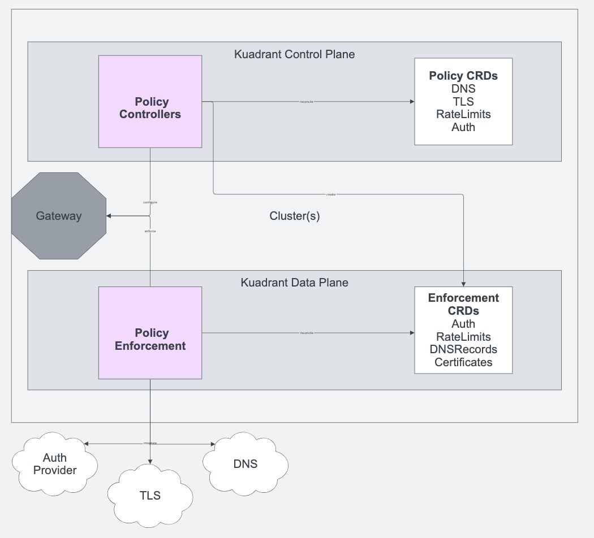

# Kuadrant Architectural Overview

<!--- variables for repeated links --->
[AuthPolicy]: https://docs.kuadrant.io/kuadrant-operator/doc/auth/
[RateLimitPolicy]: https://docs.kuadrant.io/kuadrant-operator/doc/rate-limiting/
[TLSPolicy]: https://github.com/Kuadrant/multicluster-gateway-controller/blob/main/docs/reference/tlspolicy.md
[DNSPolicy]: https://github.com/Kuadrant/multicluster-gateway-controller/blob/main/docs/reference/dnspolicy.md

## Overview

Kuadrant provides connectivity and service protection capabilities. It exposes these capabilities in the form of Kubernetes CRDs that implement the [Gateway API](https://gateway-api.sigs.k8s.io) concept of [policy attachment](https://gateway-api.sigs.k8s.io/reference/policy-attachment/). These policy APIs can target specific Gateway API resources such as `Gateways` and `HTTPRoutes` to extend their feature set and configuration to allow platform engineers to enable and collaborate with application developers to secure, protect and connect endpoints in both a single and multi-cluster environment. 

## Key Architectural Areas

* Kuadrant architecture is defined across a control plane and data plane.
* The control plane is where policies are exposed and expressed as Kubernetes APIs and reconciled by a policy controller. 
* The data plane is where Kuadrant's "policy enforcement" components exist. These components are configured by the  control plane and integrate either directly with the Gateway provider or via external integrations.

## 10000m Architecture

### Control Plane Components and Responsibilities

### Data Plane Components and Responsibilities

### Dependencies and integrations

### Cluster Layout 

### Multi-Cluster 