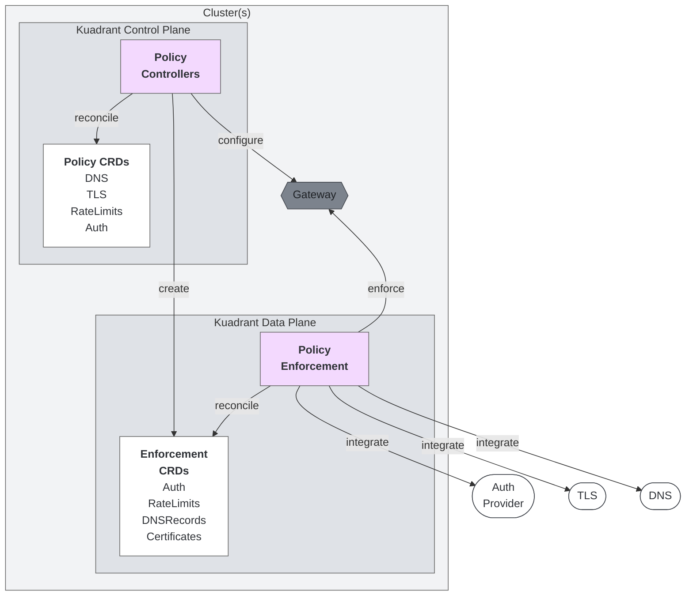
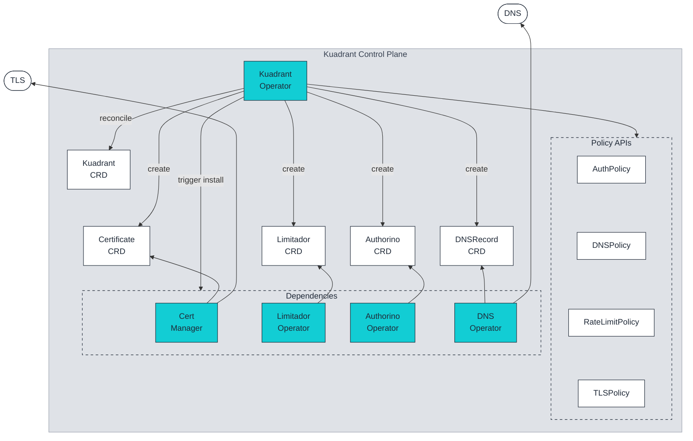
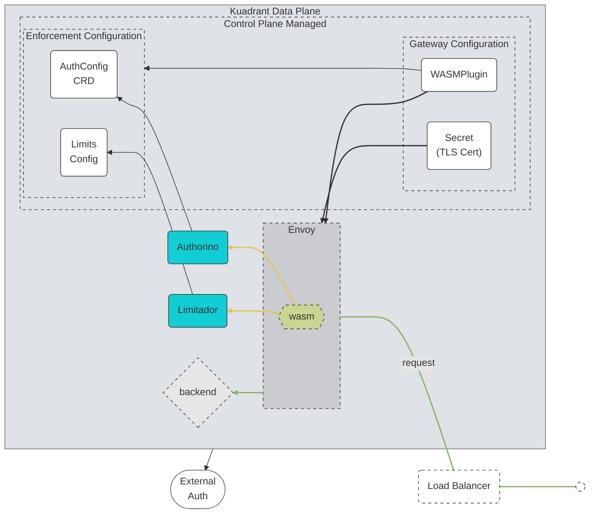
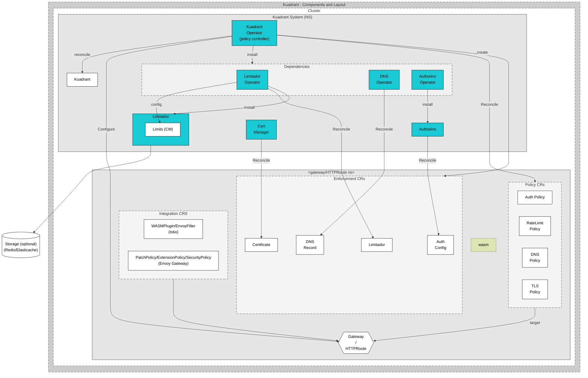
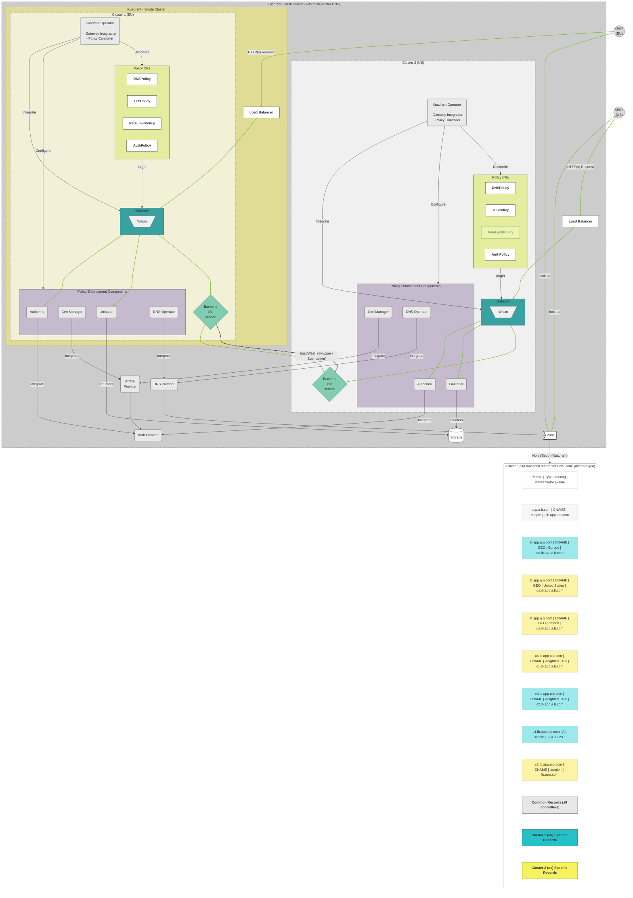
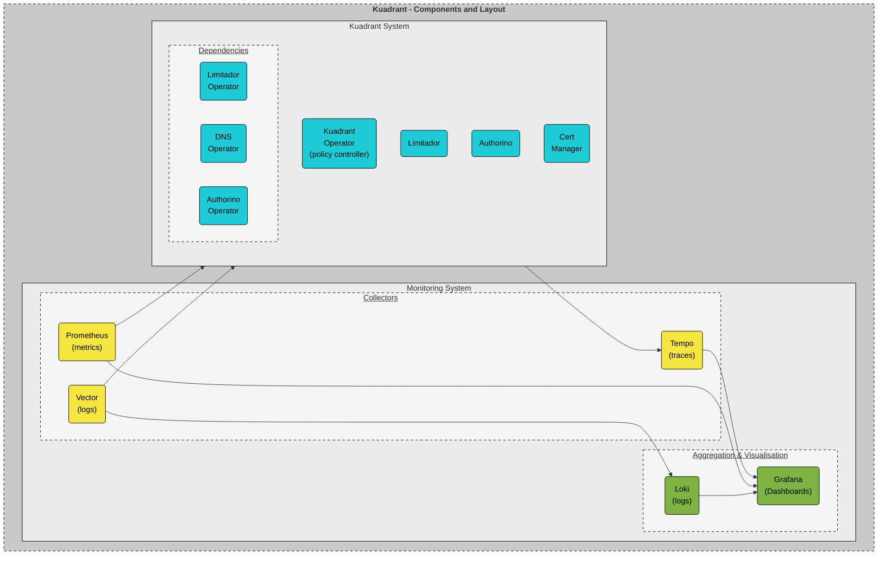
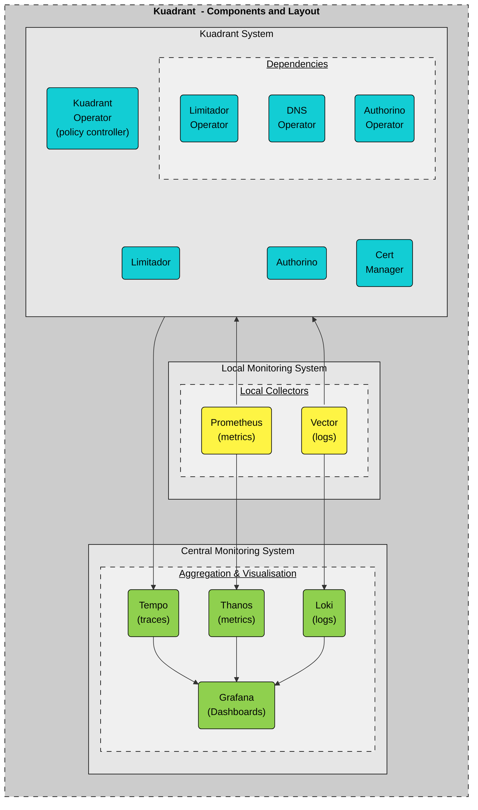

# Kuadrant Architectural Overview

<!--- variables for repeated links --->
[AuthPolicy]: https://docs.kuadrant.io/dev/kuadrant-operator/doc/overviews/auth/
[RateLimitPolicy]: https://docs.kuadrant.io/dev/kuadrant-operator/doc/overviews/rate-limiting/
[TLSPolicy]: https://docs.kuadrant.io/dev/kuadrant-operator/doc/overviews/tls/
[DNSPolicy]: https://docs.kuadrant.io/dev/kuadrant-operator/doc/overviews/dns/
[KuadrantCRD]: https://github.com/Kuadrant/kuadrant-operator/blob/main/doc/reference/kuadrant.md

## Overview

Kuadrant provides connectivity, security and service protection capabilities in both a single and multi-cluster environment. It exposes these capabilities in the form of Kubernetes CRDs that implement the [Gateway API](https://gateway-api.sigs.k8s.io) concept of [policy attachment](https://gateway-api.sigs.k8s.io/reference/policy-attachment/). These policy APIs can target specific Gateway API resources such as `Gateways` and `HTTPRoutes` to extend their capabilities and configuration. They enable platform engineers to secure, protect and connect their infrastructure and allow application developers to self service and refine policies to their specific needs in order to protect exposed endpoints.  

## Key Architectural Areas

* Kuadrant architecture is defined and implemented with both control plane and data plane components.
* The control plane is where policies are exposed and expressed as Kubernetes APIs and reconciled by a policy controller. 
* The data plane is where Kuadrant's "policy enforcement" components exist. These components are configured by the  control plane and integrate either directly with the Gateway provider or via external integrations.

## 10000m Architecture

```mermaid
flowchart TB
    subgraph Clusters["Cluster(s)"]
        subgraph ControlPlane["Kuadrant Control Plane"]
            PolicyControllers["<b>Policy<br/>Controllers</b>"]
            PolicyCRDs["<b>Policy CRDs</b><br/>DNS<br/>TLS<br/>RateLimits<br/>Auth"]
        end
        Gateway{{"Gateway"}}
        subgraph DataPlane["Kuadrant Data Plane"]
            PolicyEnforcement["<b>Policy<br/>Enforcement</b>"]
            EnforcementCRDs["<b>Enforcement<br/>CRDs</b><br/>Auth<br/>RateLimits<br/>DNSRecords<br/>Certificates"]
        end
    end

    AuthProvider(["Auth<br/>Provider"])
    TLS(["TLS"])
    DNS(["DNS"])

    Gateway ~~~ PolicyEnforcement

    PolicyControllers -- reconcile --> PolicyCRDs
    PolicyControllers -- create --> EnforcementCRDs
    PolicyControllers -- configure --> Gateway
    PolicyEnforcement -- enforce --> Gateway
    PolicyEnforcement -- reconcile --> EnforcementCRDs
    PolicyEnforcement -- integrate --> AuthProvider
    PolicyEnforcement -- integrate --> TLS
    PolicyEnforcement -- integrate --> DNS

    classDef policy fill:#f3d9fe,stroke:#666666,color:#2f3237
    classDef crd fill:#ffffff,stroke:#666666,color:#2f3237
    classDef gw fill:#7c838d,stroke:#43474e,color:#1f2226
    classDef external fill:#ffffff,stroke:#43474e,color:#2f3237
    class PolicyControllers,PolicyEnforcement policy
    class PolicyCRDs,EnforcementCRDs crd
    class Gateway gw
    class AuthProvider,TLS,DNS external
    style Clusters fill:#f2f3f5,stroke:#666666
    style ControlPlane fill:#dfe2e7,stroke:#666666
    style DataPlane fill:#dfe2e7,stroke:#666666
```

### Control Plane Components and Responsibilities

The control plane is a set of controllers and operators that are responsible for installation and configuration of other components such as the data plane enforcement components and configuration of the Gateway to enable the data plane components to interact with incoming requests. The control plane also owns and reconciles the policy CRD APIs into more complex and specific configuration objects that the policy enforcement components consume in order to know the rules to apply to incoming requests or the configuration to apply to external integrations such as DNS and ACME providers. 

```mermaid
flowchart TB
    TLS(["TLS"]):::cloud
    DNS(["DNS"]):::cloud

    subgraph KCP["Kuadrant Control Plane"]
        KuadrantCRD["Kuadrant<br/>CRD"]:::whiteBox
        KuadrantOperator["Kuadrant<br/>Operator"]:::tealBox
        CertificateCRD["Certificate<br/>CRD"]:::whiteBox
        LimitadorCRD["Limitador<br/>CRD"]:::whiteBox
        AuthorinoCRD["Authorino<br/>CRD"]:::whiteBox
        DNSRecordCRD["DNSRecord<br/>CRD"]:::whiteBox

        subgraph POLICIES["Policy APIs"]
            direction TB
            AuthPolicy["AuthPolicy"]:::whiteBox
            DNSPolicy["DNSPolicy"]:::whiteBox
            RateLimitPolicy["RateLimitPolicy"]:::whiteBox
            TLSPolicy["TLSPolicy"]:::whiteBox
            AuthPolicy ~~~ DNSPolicy ~~~ RateLimitPolicy ~~~ TLSPolicy
        end

        subgraph DEPS["Dependencies"]
            CertManager["Cert<br/>Manager"]:::tealBox
            LimitadorOperator["Limitador<br/>Operator"]:::tealBox
            AuthorinoOperator["Authorino<br/>Operator"]:::tealBox
            DNSOperator["DNS<br/>Operator"]:::tealBox
        end
    end

    %% invisible edges for layout only: clouds above the control plane,
    %% Kuadrant CRD beside the operator, dependency operators below the
    %% CRDs they reconcile (as in the source image)
    TLS ~~~ KuadrantCRD
    DNS ~~~ KuadrantOperator
    DNS ~~~ AuthPolicy
    KuadrantCRD ~~~ CertificateCRD
    CertificateCRD ~~~ CertManager
    LimitadorCRD ~~~ LimitadorOperator
    AuthorinoCRD ~~~ AuthorinoOperator
    DNSRecordCRD ~~~ DNSOperator

    KuadrantOperator -->|reconcile| KuadrantCRD
    KuadrantOperator -->|create| CertificateCRD
    KuadrantOperator -->|create| LimitadorCRD
    KuadrantOperator -->|create| AuthorinoCRD
    KuadrantOperator -->|create| DNSRecordCRD
    KuadrantOperator -->|trigger install| DEPS
    CertManager --> CertificateCRD
    LimitadorOperator --> LimitadorCRD
    AuthorinoOperator --> AuthorinoCRD
    DNSOperator --> DNSRecordCRD
    CertManager --> TLS
    DNSOperator --> DNS
    KuadrantOperator --> POLICIES

    classDef tealBox fill:#12cdd4,stroke:#1f2937,color:#1f2937
    classDef whiteBox fill:#ffffff,stroke:#1f2937,color:#1f2937
    classDef cloud fill:#ffffff,stroke:#1f2937,color:#1f2937
    style KCP fill:#dfe2e7,stroke:#9ca3af,color:#374151
    style DEPS fill:transparent,stroke:#1f2937,stroke-dasharray:5 5,color:#1f2937
    style POLICIES fill:transparent,stroke:#1f2937,stroke-dasharray:5 5,color:#1f2937
```

#### [Kuadrant Operator](https://github.com/Kuadrant/Kuadrant-operator)
* Installation and configuration of other control plane components
* Installation of data plane policy enforcement components via their respective control plane operators
* Configures the Gateway via WASM plugin and other APIs to leverage the data plane components for auth and rate limiting on incoming requests.
* Exposes [`RateLimitPolicy`][RateLimitPolicy] , [`AuthPolicy`][AuthPolicy], [`DNSPolicy`][DNSPolicy] and [`TLSPolicy`][TLSPolicy] and reconciles these into enforceable configuration for the data plane.
* Exposes [`Kuadrant`][KuadrantCRD] and reconciles this to configure and trigger installation of the required data plane components and other control plane components.

#### [Limitador Operator:](https://github.com/Kuadrant/limitador-operator)
* Installs and configures the Limitador data plane component based on the Limitador CR. Limits specified in the limitador CR are mountd via configmap into the limitador component.

#### [Authorino Operator:](https://github.com/Kuadrant/authorino-operator)
* Installs and configures the Authorino data plane component based on the Authorino CR.

#### [Cert-Manager:](https://cert-manager.io/)
* Manages TLS certificates for our components and for the Gateways. Consumes Certificate resources created by Kuadrant operator in response to the TLSPolicy.

#### [DNS Operator](https://github.com/Kuadrant/dns-operator)
* DNS operator consumes DNSRecord resources that are configured via the DNSPolicy api and applies them into the targeted cloud DNS provider.
AWS, Azure and Google DNS are our main targets.

### Data Plane Components and Responsibilities

```mermaid
flowchart RL
    EXTAUTH(["External<br/>Auth"])

    subgraph KDP["Kuadrant Data Plane"]
        subgraph CPM["Control Plane Managed"]
            subgraph EC["Enforcement Configuration"]
                AUTHCONFIG("AuthConfig<br/>CRD")
                LIMITSCONFIG("Limits<br/>Config")
            end
            subgraph GC["Gateway Configuration"]
                WASMPLUGIN("WASMPlugin")
                SECRET("Secret<br/>(TLS Cert)")
            end
        end
        AUTHORINO("Authorino")
        LIMITADOR("Limitador")
        BACKEND{"backend"}
        subgraph ENVOY["Envoy"]
            WASM{{"wasm"}}
        end
    end

    LB("Load Balancer")
    CLIENT((" "))

    WASMPLUGIN --> EC
    WASMPLUGIN --> ENVOY
    SECRET --> ENVOY
    AUTHORINO --> AUTHCONFIG
    LIMITADOR --> LIMITSCONFIG
    WASM --> AUTHORINO
    WASM --> LIMITADOR
    KDP --> EXTAUTH
    CLIENT --- LB
    LB ---|request| ENVOY
    ENVOY --> BACKEND

    style KDP fill:#DFE2E7,stroke:#666666
    style CPM fill:none,stroke:#333333,stroke-dasharray:5 5
    style EC fill:none,stroke:#333333,stroke-dasharray:5 5
    style GC fill:none,stroke:#333333,stroke-dasharray:5 5
    style ENVOY fill:#CBCCD0,stroke:#333333,stroke-dasharray:5 5
    style WASM fill:#CAD591,stroke:#333333,stroke-dasharray:5 5
    style AUTHCONFIG fill:#FFFFFF,stroke:#333333
    style LIMITSCONFIG fill:#FFFFFF,stroke:#333333
    style WASMPLUGIN fill:#FFFFFF,stroke:#333333
    style SECRET fill:#FFFFFF,stroke:#333333
    style AUTHORINO fill:#12CDD4,stroke:#333333
    style LIMITADOR fill:#12CDD4,stroke:#333333
    style BACKEND fill:#E6E6E6,stroke:#333333,stroke-dasharray:5 5
    style EXTAUTH fill:#FFFFFF,stroke:#666666
    style LB fill:#FFFFFF,stroke:#333333,stroke-dasharray:5 5
    style CLIENT fill:#FFFFFF,stroke:#333333,stroke-dasharray:5 5

    linkStyle 1 stroke:#333333,stroke-width:2px
    linkStyle 2 stroke:#333333,stroke-width:2px
    linkStyle 5 stroke:#E8C34A,stroke-width:2px
    linkStyle 6 stroke:#E8C34A,stroke-width:2px
    linkStyle 8 stroke:#82B366,stroke-width:2px
    linkStyle 9 stroke:#82B366,stroke-width:2px
    linkStyle 10 stroke:#82B366,stroke-width:2px
```

The data plane components sit in the request flow and are responsible for enforcing configuration defined by policy and providing service protection capabilities based on configuration managed and created by the control plane.

#### [Limitador](https://github.com/Kuadrant/limitador)
* Complies with the with Envoy rate limiting API to provide rate limiting to the gateway. Consumes limits from a configmap created based on the RateLimitPolicy API.

#### [Authorino](https://github.com/Kuadrant/authorino)
* Complies with the Envoy external auth API to provide auth integration to the gateway. It provides both Authn and Authz. Consumes AuthConfigs created by the Kuadrant operator based on the defined `AuthPolicy` API.

#### [WASM Shim](https://github.com/Kuadrant/wasm-shim)
* Uses the [Proxy WASM ABI Spec](https://github.com/proxy-wasm/spec) to integrate with Envoy and provide filtering and connectivity to Limitador (for request time enforcement of rate limiting) and Authorino (for request time enforcement of authentication & authorization).

### Single Cluster Layout 

In a single cluster, you have the Kuadrant control plane and data plane sitting together. It is configured to integrate with Gateways on the same cluster and configure a DNS zone via a  secret (configured alongside a DNSPolicy). Storage of rate limit counters is possible but not required as they are not being shared.

```mermaid
flowchart TB
    STORAGE[("Storage  (optional)<br/>(Redis/Elasticache)")]

    subgraph OUTER["Kuadrant  - Components and Layout"]
        subgraph CLUSTER["Cluster"]
            subgraph KSNS["Kuadrant System (NS)"]
                KUADRANT["Kuadrant"]
                KOP["Kuadrant<br/>Operator<br/>(policy controller)"]
                subgraph DEPS["Dependencies"]
                    LIMOP["Limitador<br/>Operator"]
                    DNSOP["DNS<br/>Operator"]
                    AUTHOP["Authorino<br/>Operator"]
                end
                subgraph LIMITADOR["Limitador"]
                    LIMITSCM["Limits (CM)"]
                end
                AUTHORINO["Authorino"]
                CERTMGR["Cert<br/>Manager"]
            end
            subgraph GWNS["&lt;gateway/HTTPRoute ns&gt;"]
                subgraph POLICYCRS["Policy CRs"]
                    AUTHPOL["Auth Policy"]
                    RLPOL["RateLimit<br/>Policy"]
                    DNSPOL["DNS<br/>Policy"]
                    TLSPOL["TLS<br/>Policy"]
                end
                subgraph ENFCRS["Enforcement CRs"]
                    LIMITADORCR["Limitador"]
                    DNSRECORD["DNS<br/>Record"]
                    AUTHCONFIG["Auth<br/>Config"]
                    CERTIFICATE["Certificate"]
                end
                subgraph INTCRS["Integration CRS"]
                    WASMPLUGIN["WASMPlugin/EnvoyFilter<br/>(Istio)"]
                    PATCHPOL["PatchPolicy/ExtensionPolicy/SecurityPolicy<br/>(Envoy Gateway)"]
                end
                WASM["wasm"]
                GW{{"Gateway<br/>/<br/>HTTPRoute"}}
            end
        end
    end

    KOP -- reconcile --> KUADRANT
    KOP -- install --> DEPS
    LIMOP -- Install --> LIMITADOR
    LIMOP -- config --> LIMITSCM
    LIMOP -- Reconcile --> LIMITADORCR
    DNSOP -- Reconcile --> DNSRECORD
    AUTHOP -- install --> AUTHORINO
    AUTHORINO -- Reconcile --> AUTHCONFIG
    CERTMGR -- Reconcile --> CERTIFICATE
    LIMITADOR --> STORAGE
    KOP -- Reconcile --> POLICYCRS
    KOP -- create --> ENFCRS
    KOP -- Configure --> GW
    POLICYCRS -- target --> GW
    INTCRS --> GW
    WASM ~~~ GW
    KSNS ~~~ GWNS

    classDef teal fill:#19C9D4,stroke:#000000,color:#000000
    classDef whiteBox fill:#FFFFFF,stroke:#000000,color:#000000
    classDef wasmBadge fill:#DDE5B2,stroke:#333333,color:#000000,stroke-dasharray:3 3
    class KOP,LIMOP,DNSOP,AUTHOP,AUTHORINO,CERTMGR teal
    class KUADRANT,LIMITSCM,AUTHPOL,RLPOL,DNSPOL,TLSPOL,LIMITADORCR,DNSRECORD,AUTHCONFIG,CERTIFICATE,WASMPLUGIN,PATCHPOL,GW,STORAGE whiteBox
    class WASM wasmBadge
    style OUTER fill:#CCCCCC,stroke:#444444,stroke-dasharray:8 5
    style CLUSTER fill:#FFFFFF,stroke:#444444,stroke-dasharray:8 5
    style KSNS fill:#E6E6E6,stroke:#333333
    style GWNS fill:#E6E6E6,stroke:#333333
    style DEPS fill:#F0F0F0,stroke:#333333,stroke-dasharray:8 5
    style POLICYCRS fill:#F5F5F5,stroke:#333333,stroke-dasharray:8 5
    style ENFCRS fill:#F5F5F5,stroke:#333333,stroke-dasharray:8 5
    style INTCRS fill:#F5F5F5,stroke:#333333,stroke-dasharray:8 5
    style LIMITADOR fill:#19C9D4,stroke:#000000,color:#000000
```

### Multi-Cluster 

In the default multi-cluster setup, each individual cluster has Kuadrant installed. Each of these clusters are unaware of the other. They are effectively operating as single clusters. The multi-cluster aspect is created by sharing access with the DNS zone, using a shared host across the clusters and leveraging shared counter storage. 
Multi cluster DNS is achieved by using the eventual provider DNS service (AWS Route etc ..) as a store for ownership metadata using specially created TXT records, and as a central API service that all clusters can communicate with. The zone is operated on independently by each of DNS operator on both clusters to form a single cohesive record set. Each cluster processes its own DNSRecords, becoming aware of other DNSRecords contributing to the same set of endpoints via this centrally stored data, in turn allowing it to correctly translate the DNSRecord endpoints into an appropriate API operation. More details on this can be found in the [following RFC](https://github.com/Kuadrant/architecture/pull/70).
The rate limit counters can also be shared and used by different clusters in order to provide global rate limiting. This is achieved by connecting each instance of Limitador to a shared data store that uses the Redis protocol.

```mermaid
flowchart TB
    subgraph OUTER["Kuadrant  - Multi Cluster (with multi-cluster DNS)"]
        subgraph C2["Cluster 2  (US)"]
            KO2("Kuadrant Operator<br/><br/>- Gateway Integration<br/>- Policy Controller")
            subgraph PEC2["Policy Enforcement Components"]
                LIM2("Limitador")
                CM2("Cert Manager")
                AUT2("Authorino")
                DNSO2("DNS Operator")
            end
            subgraph PCR2["Policy CRs"]
                DP2["DNSPolicy"]
                TP2["TLSPolicy"]
                RLP2["RateLimitPolicy"]
                AP2["AuthPolicy"]
            end
            BK2{"Backend<br/>k8s<br/>service"}
            subgraph GW2["Gateway"]
                WASM2[\Wasm/]
            end
        end
        subgraph KSC["Kuadrant - Single Cluster"]
            subgraph C1["Cluster 1 (EU)"]
                KO1("Kuadrant Operator<br/><br/>- Gateway Integration<br/>- Policy Controller")
                subgraph PCR1["Policy CRs"]
                    DP1["DNSPolicy"]
                    TP1["TLSPolicy"]
                    RLP1["RateLimitPolicy"]
                    AP1["AuthPolicy"]
                end
                subgraph PEC1["Policy Enforcement Components"]
                    LIM1("Limitador")
                    CM1("Cert Manager")
                    AUT1("Authorino")
                    DNSO1("DNS Operator")
                end
                BK1{"Backend<br/>k8s<br/>service"}
                subgraph GW1["Gateway"]
                    WASM1[\Wasm/]
                end
            end
            LB1["Load Balancer"]
        end
        LB2["Load Balancer"]
        STOR[("Storage")]
        ACME("ACME<br/>Provider")
        AUTHP("Auth Provider")
        DNSP("DNS Provider")
        ZONE>"zone"]
    end

    CEU(("client<br/>(EU)"))
    CUS(("client<br/>(US)"))

    subgraph DOC["2 cluster load balanced record set DNS Zone (different geo)"]
        direction TB
        RH["Record | Type | routing | differentiator | value"]
        R1["app.a.b.com | CNAME | simple |  | lb.app.a.b.com"]
        R2["lb.app.a.b.com | CNAME | GEO | Europe | eu.lb.app.a.b.com"]
        R3["lb.app.a.b.com | CNAME | GEO | United States | us.lb.app.a.b.com"]
        R4["lb.app.a.b.com | CNAME | GEO | default | us.lb.app.a.b.com"]
        R5["us.lb.app.a.b.com | CNAME | weighted | 120 | c1.lb.app.a.b.com"]
        R6["eu.lb.app.a.b.com | CNAME | weighted | 120 | c2.lb.app.a.b.com"]
        R7["c1.lb.app.a.b.com | A | simple |  | 84.17.23.1"]
        R8["c2.lb.app.a.b.com | CNAME | simple |  | lb.aws.com"]
        LG1["Common Records (all controllers)"]
        LG2["Cluster 1 (eu) Specific Records"]
        LG3["Cluster 2 (us) Specific Records"]
    end

    RH ~~~ R1
    R1 ~~~ R2
    R2 ~~~ R3
    R3 ~~~ R4
    R4 ~~~ R5
    R5 ~~~ R6
    R6 ~~~ R7
    R7 ~~~ R8
    R8 ~~~ LG1
    LG1 ~~~ LG2
    LG2 ~~~ LG3

    KO1 -->|Reconcile| PCR1
    KO1 -->|Configure| PEC1
    KO1 -->|Integrate| GW1
    PCR1 -->|target| GW1
    KO2 -->|Reconcile| PCR2
    KO2 -->|Configure| PEC2
    KO2 -->|Integrate| GW2
    PCR2 -->|target| GW2
    LIM1 -->|counters| STOR
    LIM2 -->|counters| STOR
    CM1 -->|integrate| ACME
    CM2 -->|Integrate| ACME
    AUT1 -->|integrate| AUTHP
    AUT2 -->|Integrate| AUTHP
    DNSO1 -->|integrate| DNSP
    DNSO2 -->|integrate| DNSP
    ACME --> AUTHP
    DNSP --- ZONE
    ZONE -->|"North/South (Kuadrant)"| DOC
    BK1 -.- BK2
    GW1 --> BK1
    GW1 --> LIM1
    GW1 --> AUT1
    GW2 --> BK2
    GW2 --> LIM2
    GW2 --> AUT2
    BK1 -->|"East/West  (Skupper / Submariner)"| BK2
    CEU -->|"HTTP(s) Request"| LB1
    LB1 --> GW1
    CUS -->|"HTTP(s) Request"| LB2
    LB2 --> GW2
    CEU ---|"look up"| ZONE
    CUS ---|"look up"| ZONE

    style OUTER fill:#cccccc,stroke:#333333,stroke-dasharray:4 4
    style KSC fill:#e0dc95,stroke:#666666,stroke-dasharray:4 4
    style C1 fill:#f2f0d7,stroke:#666666,stroke-dasharray:2 2
    style C2 fill:#f0f0f0,stroke:#666666,stroke-dasharray:2 2
    style PEC1 fill:#c6bace,stroke:#555555
    style PEC2 fill:#c6bace,stroke:#555555
    style PCR1 fill:#e4ed9e,stroke:#333333
    style PCR2 fill:#e4ed9e,stroke:#333333
    style GW1 fill:#39a2a0,stroke:#1f5f5e
    style GW2 fill:#39a2a0,stroke:#1f5f5e
    style DOC fill:#ffffff,stroke:#333333

    classDef opnode fill:#e9e9e9,stroke:#444444
    class KO1,KO2,LIM1,CM1,AUT1,DNSO1,LIM2,CM2,AUT2,DNSO2,ACME,AUTHP,DNSP opnode
    classDef policy fill:#ffffff,stroke:#333333,font-weight:bold
    class DP1,TP1,RLP1,AP1,DP2,TP2,AP2 policy
    classDef rlpfaded fill:#e9f4b2,stroke:#9aa96a,color:#8a9a55,font-weight:bold
    class RLP2 rlpfaded
    classDef backend fill:#81cdb1,stroke:#2e7d63
    class BK1,BK2 backend
    classDef wasm fill:#f0f0f0,stroke:#555555
    class WASM1,WASM2 wasm
    classDef lb fill:#ffffff,stroke:#333333,font-weight:bold
    class LB1,LB2 lb
    classDef store fill:#ffffff,stroke:#333333
    class STOR,ZONE store
    classDef clientnode fill:#d9d9d9,stroke:#666666
    class CEU,CUS clientnode
    classDef rowhead fill:#ffffff,stroke:#cccccc
    class RH rowhead
    classDef rowcommon fill:#f7f7f7,stroke:#cccccc
    class R1 rowcommon
    classDef roweu fill:#9be9ec,stroke:#cccccc
    class R2,R6,R7 roweu
    classDef rowus fill:#fdf3a6,stroke:#cccccc
    class R3,R4,R5,R8 rowus
    classDef legcommon fill:#e7e7e7,stroke:#333333,font-weight:bold
    class LG1 legcommon
    classDef legeu fill:#26c1c6,stroke:#333333,font-weight:bold
    class LG2 legeu
    classDef legus fill:#f7f260,stroke:#333333,font-weight:bold
    class LG3 legus

    linkStyle 30 stroke:#1a1a1a,stroke-width:3px
    linkStyle 31,32,33,34,35,36,37,38,39,40,41,42,43 stroke:#7fbf3f,stroke-width:2px
```

Shown above is a multi-cluster multi ingress gateway topology. This might be used to support a geographically distributed system for example. However, it is also possible to leverage overlay networking tools such as [Skupper](https://skupper.io) that integrate at the Kubernetes service level to have a single gateway cluster that then integrates with multiple backends (on different clusters or in custom infrastructure).

### Observability

The Kuadrant architecture is intended to work with some popular monitoring tools for tracing, metrics and log aggregation.
Those tools are:

- [Prometheus](https://prometheus.io/) for scraping metrics - and optionally [Thanos](https://github.com/thanos-io/thanos) for high availability & federation
- [Loki](https://github.com/grafana/loki) for log aggregation - via log collectors like [vector](https://github.com/vectordotdev/vector)
- [Tempo](https://github.com/grafana/tempo) for trace collecting
- [Grafana](https://github.com/grafana/grafana) for visualing the above

Depending on the number of clusters in your configuration, you may decide to have a monitoring system on the same cluster as workloads,
or in a separate cluster completely.
Below are 2 example architectures based on the single cluster and multi cluster layouts.
In the single cluster architecture, the collector components (Prometheus, Vector and Tempo) are in the same cluster as the log aggregation (Loki) and visualisation component (Grafana).

```mermaid
flowchart TB
    subgraph OUTER["<b>Kuadrant - Components and Layout</b>"]
        subgraph KS["Kuadrant System"]
            subgraph DEPS["<u>Dependencies</u>"]
                direction LR
                LIMOP("Limitador<br/>Operator")
                DNSOP("DNS<br/>Operator")
                AUTHOP("Authorino<br/>Operator")
            end
            KOP("Kuadrant<br/>Operator<br/>(policy controller)")
            LIM("Limitador")
            AUTH("Authorino")
            CERT("Cert<br/>Manager")
        end
        subgraph MS["Monitoring System"]
            subgraph COLL["<u>Collectors</u>"]
                TEMPO("Tempo<br/>(traces)")
                PROM("Prometheus<br/>(metrics)")
                VECTOR("Vector<br/>(logs)")
            end
            subgraph AGG["<u>Aggregation &amp; Visualisation</u>"]
                GRAFANA("Grafana<br/>(Dashboards)")
                LOKI("Loki<br/>(logs)")
            end
        end
    end

    KS --> TEMPO
    PROM --> KS
    VECTOR --> KS
    TEMPO --> GRAFANA
    PROM --> GRAFANA
    VECTOR --> LOKI
    LOKI --> GRAFANA

    classDef kuadrant fill:#1dccd6,stroke:#000000,color:#000000
    classDef collector fill:#f5e642,stroke:#000000,color:#000000
    classDef aggviz fill:#7cb342,stroke:#000000,color:#000000
    class LIMOP,DNSOP,AUTHOP,KOP,LIM,AUTH,CERT kuadrant
    class TEMPO,PROM,VECTOR collector
    class GRAFANA,LOKI aggviz

    style OUTER fill:#c9c9c9,stroke:#000000,stroke-dasharray:5 5
    style KS fill:#ececec,stroke:#000000
    style MS fill:#ececec,stroke:#000000
    style DEPS fill:#f5f5f5,stroke:#000000,stroke-dasharray:5 5
    style COLL fill:#f5f5f5,stroke:#000000,stroke-dasharray:5 5
    style AGG fill:#f5f5f5,stroke:#000000,stroke-dasharray:5 5
```

In the multi cluster architecture, the collectors that scrape metrics or logs (Prometheus & Vector) are deployed alongside the workloads in each cluster.
However, as traces are sent to a collector (Tempo) from each component, it can be centralised in a separate cluster.
Thanos is used in this architecutre so that each prometheus can federate metrics back to a central location.
The log collector (vector) can forward logs to a central loki instance.
Finally, the visualisation component (Grafana) is centralised as well, with data sources configured for each of the 3 components on the same cluster.

```mermaid
flowchart TB
    subgraph OUTER["<b>Kuadrant&nbsp; - Components and Layout</b>"]
        direction TB
        subgraph KS["Kuadrant System"]
            direction TB
            KOP("Kuadrant<br/>Operator<br/>(policy controller)")
            subgraph DEPS["<u>Dependencies</u>"]
                direction LR
                LO("Limitador<br/>Operator")
                DO("DNS<br/>Operator")
                AO("Authorino<br/>Operator")
            end
            LIM("Limitador")
            AUTH("Authorino")
            CERT("Cert<br/>Manager")
        end
        subgraph LMS["Local Monitoring System"]
            subgraph LC["<u>Local Collectors</u>"]
                PROM("Prometheus<br/>(metrics)")
                VEC("Vector<br/>(logs)")
            end
        end
        subgraph CMS["Central Monitoring System"]
            subgraph AV["<u>Aggregation &amp; Visualisation</u>"]
                TEMPO("Tempo<br/>(traces)")
                THANOS("Thanos<br/>(metrics)")
                LOKI("Loki<br/>(logs)")
                GRAF("Grafana<br/>(Dashboards)")
            end
        end
    end

    KOP ~~~ LIM
    LO ~~~ LIM
    DO ~~~ AUTH
    AO ~~~ CERT
    KS <--> PROM
    KS <--> VEC
    KS --> TEMPO
    PROM --> THANOS
    VEC --> LOKI
    TEMPO --> GRAF
    THANOS --> GRAF
    LOKI --> GRAF
    linkStyle 4 marker-end:none
    linkStyle 5 marker-end:none

    classDef kuadrant fill:#12CDD4,stroke:#000000,color:#000000
    classDef collector fill:#FEF444,stroke:#000000,color:#000000
    classDef central fill:#8FD04E,stroke:#000000,color:#000000
    class LO,DO,AO,KOP,LIM,AUTH,CERT kuadrant
    class PROM,VEC collector
    class TEMPO,THANOS,LOKI,GRAF central

    style OUTER fill:#CCCCCC,stroke:#000000,stroke-dasharray:8 8,color:#000000
    style KS fill:#E6E6E6,stroke:#000000,color:#000000
    style LMS fill:#E6E6E6,stroke:#000000,color:#000000
    style CMS fill:#E6E6E6,stroke:#000000,color:#000000
    style DEPS fill:#F0F0F0,stroke:#000000,stroke-dasharray:8 8,color:#000000
    style LC fill:#F0F0F0,stroke:#000000,stroke-dasharray:8 8,color:#000000
    style AV fill:#F0F0F0,stroke:#000000,stroke-dasharray:8 8,color:#000000
```

### Dependencies

#### [Istio](https://istio.io) or [Envoy Gateway](https://gateway.envoyproxy.io/):
* Gateway API provider that Kuadrant integrates with via WASM to provide service protection capabilities. Kuadrant configures Envoy Proxy via the Istio/Envoy Gateway control plane in order to enforce the applied policies and register components such as Authorino and Limitador. 
* Used by [`RateLimitPolicy`][RateLimitPolicy] and [`AuthPolicy`][AuthPolicy]
#### [Gateway API](https://github.com/kubernetes-sigs/gateway-api): **Required**
* New standard for Ingress from the Kubernetes community
* Gateway API is the core API that Kuadrant integrates with.
