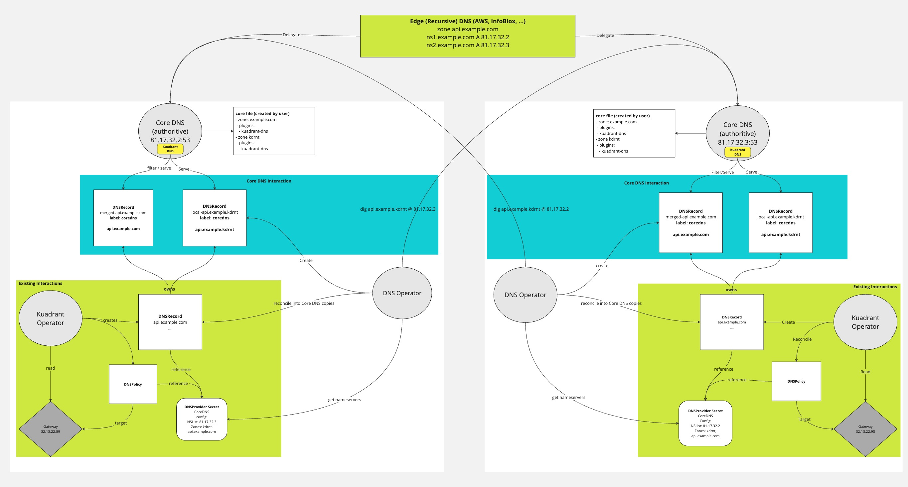

### Core DNS Integration


With DNSPolicy, Kuadrant allows users to have their DNS managed automatically based on the gateways they define, and the provider they configure. This DNS integration, is focused solely on having all of your records stored in a cloud DNS providers. Some users do not use cloud DNS providers or want to limit their exposure to cloud providers instead opting for something fully self managed or a hybrid model where the zone is delegated to DNS servers running within their own infrastructure.


### Overview

To provide integration with Core DNS, we will add changes to the DNS Operator and also develop a kuadrant [Core DNS plugin](https://coredns.io/manual/plugins/) that will source records from the `kuadrant.io/DNSRecord` resource and will be responsible for applying a GEO and weighted response equivalent to what is provided by the various cloud DNS providers we support. There will be no changes to the DNSPolicy API and no needed changes to the kuadrant policy controllers. This integration will be isolated to the DNS Operator and the new plugin.

#### Architecture



It is expected that each cluster will have an instance of Core DNS with the kuadrant plugin compiled in via the plugin mechanism. We will provide a reference image that will be used for testing. 

The kuadrant plug-in will need to be enabled by the user for zones that will be handed by this Core DNS instance via the [core file](https://coredns.io/2017/07/23/corefile-explained/). These should be zones that will be used for holding the records for the gateway listener hostnames. In addition we will expect a `kdrnt` zone to always be defined as we will be adding specific "gateway local" records with a `.kdrnt` tld (more below).

Example CoreFile:

```
 
    kdrnt {
        debug
        errors
        log
        kuadrant
        prometheus 0.0.0.0:9153
    }
    k.example.com {
        debug
        errors
        log
        geoip GeoLite2-City-demo.mmdb {
            edns-subnet
        }
        metadata
        kuadrant
        prometheus 0.0.0.0:9153
    }

```

As is the case now, each cluster will also have Kaudrant running and so an instance of DNS Operator installed. It will be the responsibility of the DNS Operator to build a "merged" DNSRecord based on the response for the `kdrnt` tld from each Core DNS acting as an authoritative nameserver for a given host ultimately specified via a gateway listener host. 

In order to have the DNS records managed by Core DNS made available to external client, it is expected that a recursive "edge" DNS provider will need to delegate the zone(s) and set the Core DNS instances as the nameservers to use for those zones. This recursive DNS server could be a cloud provider or a in house solution.


#### Core DNS DNSProvider

We will re-use the existing concept of a `DNSProvider` in order to configure the DNS Operator. This DNSProvider will have a type of `kuadrant.io/coredns` which is in line with how other provider secrets are distinguished. The Core DNS provider secret, rather than holding credentials, will instead hold the locations of all the authoritative nameservers for a given set of domains. It will also have the zones that are handled being handled by Core DNS. This provider secret is configured by the user.

```
type: kuadrant.io/coredns
data:
  NAMESERVERS: 10.22.100.23:53,10.22.100.24:53
  ZONES: k.example.com, k2.example.com
```

##### DNS Operator

When the DNS Operator sees a DNSRecord that has been configured with a core dns provider secret, it will look to setup two additional records. Each of these records will be owned by the original and so cleaned up when the original is deleted:

1) A DNSRecord with the endpoints to bring traffic to the local gateway. This DNSRecord is the "gateway local" copy and the DNSOperator will set this up with a root domain that matches the original DNSRecord but append the `kdrnt` TLD. In addition this record will be no weighting or geo provider specific meta-data. Instead these will be represented as TXT records. This is so they can be queried via a DNS query and used to form a complete DNS response for the original host from any Core DNS instance; it is these records that other DNS Operator instances will be querying in order to build a full record set and any GEO or Weighting configuration for a given dns name.

2) A DNSRecord that is the product of merging each of the configured authoritative nameservers records for the gateway listener under the `kdrnt` TLD (including the weighting and geo txt records). As well as having all the available records, this DNSRecord will also have the configured GEO and weighting data set in the provider specific section of the endpoint spec.  The kuadrant plugin will read these DNSRecords and apply the GEO and Weighted configuration when serving back the DNS response for a query relating to the original gateway listener host.


#### CoreDNS Kaudrant Plugin

The CoreDNS kuadrant plugin follows the [Core DNS plugin](https://coredns.io/manual/plugins/) model. It sets up watch and listers on kuadrant's DNSRecord resources in the k8s cluster and as it discovers them processes them and adds the endpoints to the appropriate DNS zone with the correct GEO and Weighted data.

**Weighting**

For weighted responses, the Kaudrant plugin builds a list of all the available records that could be provided as the answer to a given query from within the identified zone. It then applies a weighting algorithm to decide on a single response depending on the individual record weighting. It is effectively decided each time based on a random number between 0 and the sum of all the weights. So it is not a super predictable response but is a correctly weighted response.

**GEO**

GEO data is sourced from a geo database such as MaxMind. This is then made available via the existing [GEO plugin](https://coredns.io/plugins/geoip/) from CoreDNS. This plugin must execute before the Kuadrant plugin in order for GEO based responses to be provided. With this plugin enabled, Kuadrant can use the GEO data to decide which record to return to the DNS query.

**Weighting within a GEO**

It can be the case that you have multiple endpoints within a single GEO and want to weight traffic across those endpoints. In this case the Kuadrant plugin will first apply the GEO filter and then use the weighting filter on the result if there is more than one endpoint within a given GEO.

#### kdrnt TLD

In order to make the "gateway local" records available to each other location without applying any weighting or geo data, each Core DNS instance also serves a zone for `kdrnt`. This zone is unique to the kaudrant needs and is only used for look up purposes by each instance of the DNS Operator in order to build a full picture of all of the available dns endpoints for given host.

**Example:**
```
Gateway:
  Listener:
     Host: k.example.com
```

A local record is set up for `k.example.com.kdrnt`. It is this domain that is requested from the DNS Operator instances. Effectively each DNS Operator queries each nameserver it has been configured with via the DNSProvider secret something equivilant to `dig @nameserver k.example.com.kdrnt`. The response from each nameserver is then merged into a single `k.example.com` DNSRecord and served via the CoreDNS plugin. This means each Core DNS instance can serve a valid response for a query for `k.example.com`.
