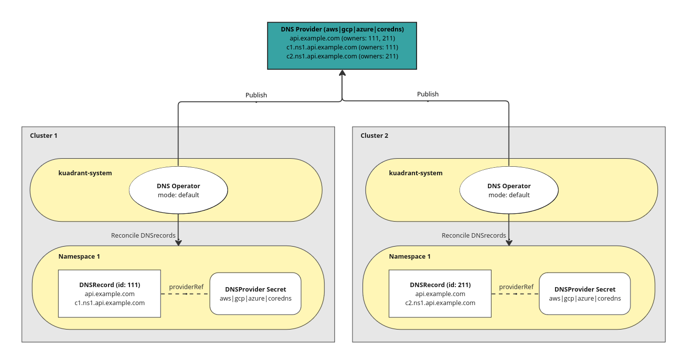
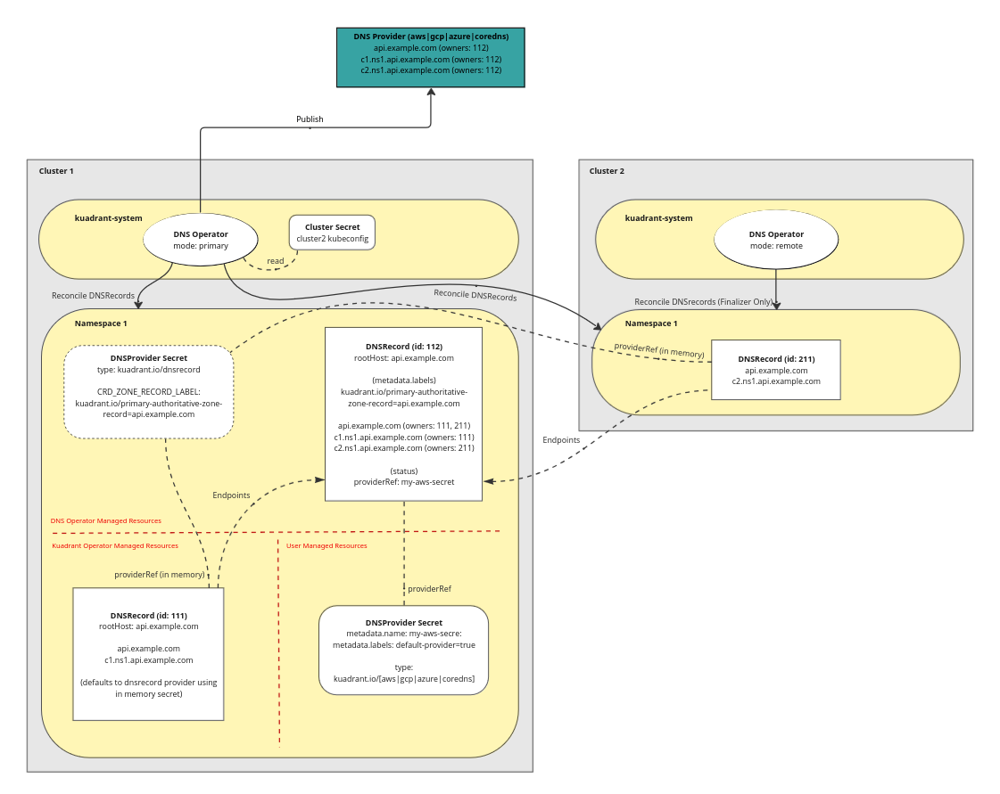
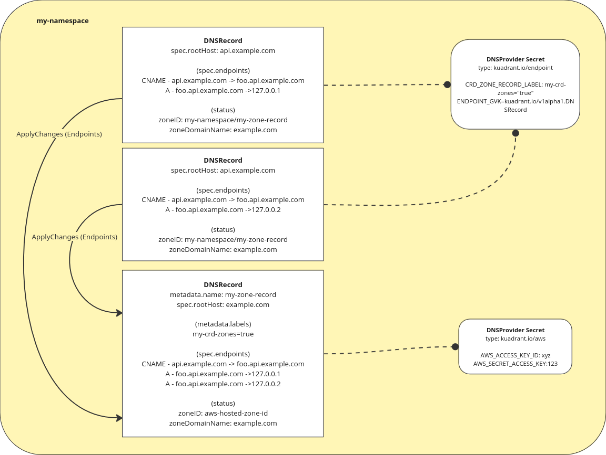

# Cluster Aware DNSRecord Delegation

- Feature Name: `cluster_aware_dnsrecord_delegation`
- Start Date: (fill me in with today's date, YYYY-MM-DD)
- RFC PR: [Kuadrant/architecture#0000](https://github.com/Kuadrant/architecture/pull/0000)
- Issue tracking: [Kuadrant/architecture#0000](https://github.com/Kuadrant/architecture/issues/0000)

# Summary
[summary]: #summary

Proposal to add functionality to delegate the processing of a DNSRecord to a designated cluster or clusters in a multi cluster environment. 

# Motivation
[motivation]: #motivation

Multi cluster DNS is currently achieved by using the eventual provider DNS service (AWS Route etc ..) as a store for ownership metadata using specially created TXT records, and as a central API service that all clusters can communicate with.
Each cluster processes its own DNSRecords, becoming aware of other DNSRecords contributing to the same set of endpoints via this centrally stored data, in turn allowing it to correctly translate the DNSRecord endpoints into an appropriate API operation (Create/Update/Delete) and get to the desired state. 

In some cases, such as our current CoreDNS solution, there is no central off cluster API service that can be configured on all clusters and as such a different approach to multiple cluster discovery and reconciliation is required.

* Add a provider agnostic alternative for multi cluster dns support while still maintaining current behaviour for existing providers.
* Reduce the number of required CoreDNS instances to one, but still allow multiple if required, redundancy etc...

# Guide-level explanation
[guide-level-explanation]: #guide-level-explanation

## DNS Operator modes

The DNS Operator can be configured to work in different modes specified via a controller flag `mode` which must be one of `default`, `primary` or `remote` i.e. `--mode=[default|primary|remote]`.
To allow for customisation of this mode via an OLM deployment of the kuadrant-operator, the mode will also be configurable via an environment variable `DNS_MODE`, which can optionally be loaded from a config map in the controller namespace.

The mode will determine the behaviour of the reconciliation of all DNSRecords that this controller instance is processing, with the `primary` and `remote` modes designed to work together in multi cluster environments.

### Default (current behaviour)

DNSRecords will be reconciled and published to the provider by this instance with no delegation, this is the same behaviour as the operator today and is the default mode used if none is specified.

This mode should be selected for single cluster scenarios, and/or where the current approach to multi cluster is to be maintained.

### Primary

DNSRecords will be reconciled and published to the provider through an authoritative zone DNSRecord which is created on behalf of the primary DNSRecord with all publishing requests delegated to it.
The dns operator will ensure the existence of the authoritative zone DNSRecord, with:
  * the same `metdata.namespace` as the current record
  * a descriptive generated `metadata.name` i.e. `primary-authoritative-zone-record-<hash>`
  * the same `spec.rootHost` as the current record
  * a label that signals it is an authoritative zone record and the `rootHost` (zone dnsName) it's for i.e. `kuadrant.io/primary-authoritative-zone-record=foo.example.com`
  * an empty `spec.providerRef` relying on the existence of a [default provider secret](#default-provider-secret) having been created in the same namespace.

DNSRecords are not expected to have a `spec.providerRef` and any set will be ignored when reconciled. Internally an instance of the [dnsrecord provider](#dnsrecord-provider) will be loaded with the `CRD_ZONE_RECORD_LABEL` set to `kuadrant.io/primary-authoritative-zone-record=<$spec.RootHost>`.

The above allows a DNSRecord to be reconciled using the created/existing authoritative zone DNSRecord as the target for all updates.

This mode should be selected for multi cluster scenarios where this cluster is a designated "primary" cluster with elevated privileges to access external DNS providers.

### Remote

DNSRecords will be reconciled by this instance, but only to maintain a finalizer on the resource and to manage the state of individual endpoints using health checks. 
DNSRecords are not expected to have a `providerRef` and any set will be ignored when reconciled on the corresponding primary clusters.
The expectation is that a different "primary" cluster will reconcile the resource, adding its endpoints to the shared authoritative zone record on its cluster, and update its status.

This mode should be selected for multi cluster scenarios where this cluster is a "remote" non-privileged cluster.

## Cluster Aware Controller

The DNS reconciler can be made cluster aware allowing it to process DNSRecord resources on other clusters as well as its own.
Making the controller aware of other clusters is done via labeled secret resources (`kuadrant.io/multicluster-kubeconfig: "true"`) containing kubeconfig data that exist in the `kuadrant-system` namespace.
The kubeconfig data should be generated from an appropriately scoped service account that exists on the target cluster.
When a cluster secret is created, the DNS controller on that cluster will automatically detect it and start watching for DNSRecord resources on that external cluster as well as its own.

**Example** Secret containing kubeconfig data
```yaml
apiVersion: v1
kind: Secret
data:
  kubeconfig: <kubeconfig data>
metadata:
  labels:
    kuadrant.io/multicluster-kubeconfig: "true"
  name: kind-kuadrant-local-2
  namespace: kuadrant-system
type: Opaque
```

## Namespace requirements for multi cluster

When configuring clusters to work in multi cluster modes, certain requirements must be met in order for DNSRecords from remote clusters to be considered part of the same record set and ultimately combined into the single "authoritative" DNSRecord on the "primary".

* DNSRecord, and by extension on all other relevant resources Gateways, DNSPolicy etc., must be in a namespace with the same name on both the "primary" and "remote" clusters.
* Default provider secrets must be in a namespace with the same name on the "primary" and the DNSRecord on the "remote".

## Default Provider Secret

A new concept of "default provider secret" will be introduced that removes the need for a `providerRef` to be specified on every DNSRecord and DNSPolicy.
When a DNSPolicy is created with no `providerRef` the resulting DNSRecord during initial reconciliation will search for a default provider secret in the current namespace to use instead.
The DNSRecord status will be updated to include the selected provider secret as a `providerRef` in the status.
A default provider secret is any provider secret that has been appropriately labelled with the kuadrant default provider label (`kuadrant.io/default-provider=true`)
Only one default provider can exist in any namespace. 
If more than one exists in the same namespace, any DNSRecord resource searching for a default provider will have its status updated with an appropriate error message and will not be able to reconcile until the extra provider secret is removed or re-labelled.  

**Example** AWS Provider set as default
```yaml
apiVersion: v1
kind: Secret
data:
  AWS_ACCESS_KEY_ID: xxx
  AWS_SECRET_ACCESS_KEY: xxx
metadata:
  labels:
    kuadrant.io/default-provider: "true"
  name: my-provider-crd-secret
  namespace: my-namespace
type: kuadrant.io/aws
```

## Example Configurations

**Default configuration.** Multi cluster using default mode (Current behaviour)



**Primary/Remote Configuration.** Multi cluster using primary/remote modes, cluster aware controller and default provider secrets



# Reference-level explanation
[reference-level-explanation]: #reference-level-explanation

## Kuadrant Operator

The only change required in the kuadrant operator is to allow the DNSPolices to be created without a providerRef specified.
In multi cluster scenarios using the dns operator in "primary" or "remote" modes, the use of a [default provider secret](#default-provider-secret) on the primary clusters will be required rendering any `providerRef` specified in the policy spec redundant. 

### Changes required
* Update the DNSPolicy API:
  * allow empty `spec.providerRefs` value
* Create the DNSRecord resource for each listener as normal, setting `dnsrecord.spec.providerRef` to nil if `dnspolicy.spec.providerRefs` is empty.  

## DNS Operator

### Allow default provider secret

#### Changes required

* Update the DNSRecord API:
  * make `spec.providerRef` optional
  * add  `status.providerRef`
* If no `spec.providerRef` the dns operator will look for a provider secret labelled as the "default" i.e. `kuadrant.io/default-provider=true` and assign that to the DNSRecord
  * If no provider found the record will not become ready and will have an appropriate error message
* Update the status to specify the `providerRef` that was selected, in the case where a `providerRef` is specified in the spec this should also be reflected in the status.
* When loading the provider after provider selection it should load it using the status `providerRef`

### Add Endpoint provider

Add a new provider implementation (endpoints) that allows any resource that fulfils the contract for an [external-dns Endpoint resource](https://github.com/kubernetes-sigs/external-dns/blob/master/apis/v1alpha1/dnsendpoint.go#L36-L42) to act as a central "zone" resource that can be updated by many DNSRecord resources in matching namespaces.
Endpoints from the source are injected into the target "zone" resource endpoints slice using the same plan logic as all other providers in order to take advantage of already existing conflict resolution e.g. A vs CNAME record types for the same dns names.



#### Changes required

* Update the provider factory constructor logic to allow the kubeclient to optionally be passed to providers
* Add a new provider called "endpoints" that implements the Provider interface
  * Configuration should allow a GVK to be specified which determines the CRD resources that should be considered zones, default to `kuadrant.io/v1alpha1.DNSRecord`
  * `provider.Records()` should be implemented to list all endpoint resources in the current namespace that match a given label selector (default: kuadrant.io/crd-provider-zone-record="true").
    * The label selector should be configurable via data contained in the provider secret (e.g. CRD_ZONE_RECORD_LABEL=my-own-label="my-expected-label-value")
    * The GVK of the endpoint resources to target should be configurable via data contained in the provider secret (e.g. ENDPOINT_GVK=kuadrant.io/v1alpha1.DNSRecord)
    * The label selector should match exactly allowing it to be used in different scenarios where we might want a more specific match e.g. kuadrant.io/primary-authoritative-zone-record="api.example.com"
  *  `provider.DNSZones()` should return all endpoint resources with the configured label selector, transformed into `provider.DNSZone` resources
    * DNSZone.ID = <endpoint resource>.metadata.name
    * DNSZone.DNSName = <endpoint resource>.spec.rootHost
  * `provider.ApplyChanges()` should update the target endpoint resource using the given changes by modifying the `spec.endpoints` slice by applying the creates/updates/deletes and saving the changes.
    * The correct target DNSRecord should be located using the ZoneID that is already passed along by the controller in `config.ZoneIDFilter.ZoneIDs[0]`
    * When applying updates we should make sure that the expected previous value matches the current value in the record on cluster to try and avoid (https://github.com/Kuadrant/dns-operator/issues/181)

**Example** CRD Provider secret with optional label selector and GVK
```yaml
apiVersion: v1
kind: Secret
data:
  CRD_ZONE_RECORD_LABEL: kuadrant.io/primary-authoritative-zone-record
  ENDPOINT_GVK: kuadrant.io/v1alpha1.DNSRecord
metadata:
  name: my-provider-endpoint-secret
  namespace: my-namespace
type: kuadrant.io/endpoint
```

### Make controller cluster aware

#### Changes required

* Add watch on secrets in a specified namespace e.g. kuadrant-system with a given label e.g. `kuadrant.io/multicluster-kubeconfig: "true"`
* The namespace and label should be configurable via flags to the controller:
  * `--cluster-secret-namespace` The Namespace to look for cluster secrets. default: kuadrant-system
  * `--cluster-secret-label` The label that identifies a Secret resource as a cluster secret. default: kuadrant.io/multicluster-kubeconfig
* Cluster secrets are expected to contain kubeconfig data, when one is found it should be registered as a "cluster" and a watch for DNSRecord resources started inside a runnable go routine.
* Add a new role to the dns operator that contains the minimum required permissions needed for a "primary" cluster to process the DNSRecord resources on a "remote" cluster.
```yaml
apiVersion: rbac.authorization.k8s.io/v1
kind: ClusterRole
metadata:
  name: remote-cluster-role
rules:
- apiGroups:
    - kuadrant.io
  resources:
    - dnsrecords
  verbs:
    - get
    - list
    - watch
- apiGroups:
    - kuadrant.io
  resources:
    - dnsrecords/status
  verbs:
    - get
    - patch
    - update
```
* Add a means e.g. script, kuadrantctl command etc.., in which a user can easily create a new cluster secret on a target "primary" cluster giving details of a "remote" cluster and service account on it.

### Add authoritative record delegation support

ToDO mnairn: Add updated details here

#### Changes required

* Allow the dns operator to load controller configuration options from a configMap that optionally exists in the same namespace as the controller. 
* The configMap should allow env vars that correspond to controller flags to be set and override the value. e.g. `DNS_MODE="primary" == --mode=primary`.

### Update CoreDNS provider

Update the CoreDNS provider to rely solely on the new multi cluster mechanism being introduced by this rfc. 
Unlike other providers, this will be the only supported way of achieving multi cluster support when using CoreDNS.

#### Changes required

* Revert the majority of CoreDNS specific logic added to the dns controller, and instead let it follow the nomral reconciliation path.
* Add a mechanism that allows "labels" to be specified, per provider, that must be ensured on the target DNSRecord resources they are targeting.
* Add the "kuadrant.io/coredns-zone-name=$rootHost" label to DNSRecords using the CoreDNS provider so that it is picked up directly by the kuadrant coredns plugin.
* The majority of the `provider` interface will be stubbed out since it no longer needs to do any endpoint manipulation directly, instead relying on the target DNSRecord being in the desired state.
  * `provider.DNSZones` unchanged, will still be used for zone selection
  * `provider.DNSZoneForHost` unchanged
  * `provider.Records` stubbed, no longer needed
  * `provider.ApplyChanges` stubbed, no longer needed
  * `provider.AdjustEndpoints` stubbed, no longer needed
# Drawbacks
[drawbacks]: #drawbacks

* Adds another path through the code that isn't strictly necessary for the majority of providers.
* A record being added that introduces a failure in the provider request (misconfiguration etc..) will cause multiple clusters endpoints from being updated until the issue is resolved. 

# Rationale and alternatives
[rationale-and-alternatives]: #rationale-and-alternatives

The initial idea here was to look at a way to "push" records from multiple "remote" clusters to a central "primary" cluster that would be in charge of combining those records into a single "authoritative" record and ultimately in charge of publishing that record to the provider (CoreDNS). 
This would require all clusters to have credentials capable of writing to the "primary" cluster.

However, it appears to be a more common pattern in kubernetes projects that deal with multi cluster communication to have the "primary" clusters read from multiple "remote" clusters. 
This would also only require the "primary" to have read access, or very limited write (status only) access to each cluster.

# Prior art
[prior-art]: #prior-art

* https://istio.io/latest/docs/setup/install/multicluster/
* https://github.com/kubernetes-sigs/multicluster-runtime

# Unresolved questions
[unresolved-questions]: #unresolved-questions

# Future possibilities
[future-possibilities]: #future-possibilities

* While this is being proposed for the purposes of improving our current CoreDNS solution, there is no reason that this can't be used by any provider and might become a better alternative for multi cluster generally.  
