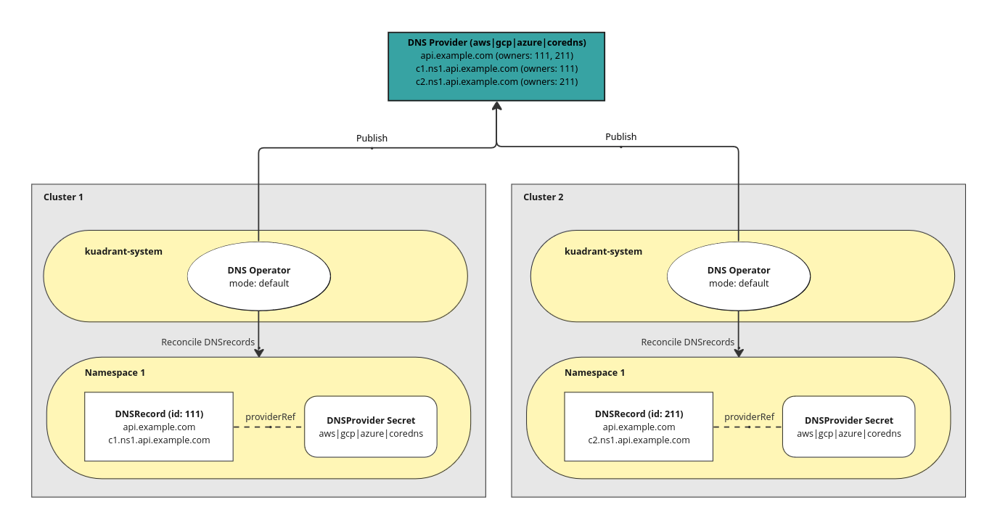
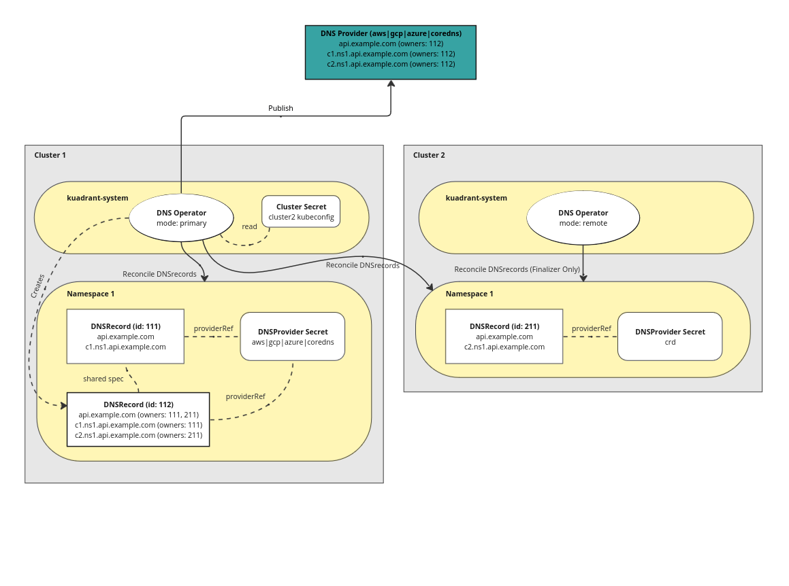
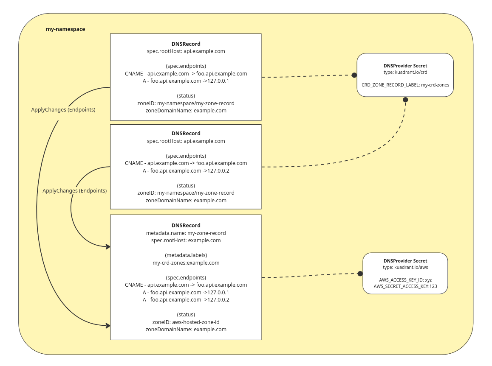

# DNS Cluster Aware Delegation

- Feature Name: `dns_cluster_aware_delegation`
- Start Date: (fill me in with today's date, YYYY-MM-DD)
- RFC PR: [Kuadrant/architecture#0000](https://github.com/Kuadrant/architecture/pull/0000)
- Issue tracking: [Kuadrant/architecture#0000](https://github.com/Kuadrant/architecture/issues/0000)

# Summary
[summary]: #summary

Proposal to add functionality to delegate the processing of a DNSRecord to a designated cluster or clusters in a multi cluster environment. 

# Motivation
[motivation]: #motivation

Multi cluster DNS is currently achieved by using the eventual provider DNS service (AWS Route etc ..) as a store for ownership metadata using specially created TXT records, and as a central API service that all clusters can communicate with.
Each cluster processes its own DNSRecords, becoming aware of other DNSRecords contributing to the same set of endpoints via this centrally stored data, in turn allowing it to correctly translate the DNSRecord endpoints into an appropriate API operation (Create/Update/Delete) and get to the desired state. 

In some cases, such as our current CoreDNS solution, there is no central off cluster API service that can be configured on all clusters and as such a different approach to multiple cluster discovery and reconciliation is required.

* Add a provider agnostic alternative for multi cluster dns support while still maintaining current behaviour for existing providers.
* Reduce the number of required CoreDNS instances to one, but still allow multiple if required, redundancy etc...

# Guide-level explanation
[guide-level-explanation]: #guide-level-explanation

## DNS Operator modes

The DNS Operator can be configured to work in different modes specified via a controller flag `mode` which must be one of `default`, `primary` or `remote` i.e. `--mode=[default|primary|remote]`.
To allow for customisation of this mode via an OLM deployment of the kuadrant-operator, the mode will also be configurable via an environment variable `DNS_MODE`.  

The mode will determine the behaviour of the reconciliation of all DNSRecords that this controller instance is processing, with the `primary` and `remote` modes designed to work together in multi cluster environments.

### Default (current behaviour)

DNSRecords will be reconciled and published to the provider by this instance with no delegation, this is the same behaviour as the operator today and is the default mode used if none is specified.
DNSRecords on these clusters must have access to valid provider credentials referenced in the spec.
This mode should be selected for single cluster scenarios, and/or where the current approach to multi cluster is to be maintained.

### Primary

DNSRecords will be reconciled and published to the provider by this instance through an authoritative DNSRecord which is created on behalf of the primary DNSRecord that all publishing requests are delegated to.
DNSRecords on these clusters must have access to valid provider credentials referenced in the spec.
The authoritative DNSRecord is created in the same namespace as the original DNSRecord (created by the DNSPolicy or otherwise) and at a minimum will contain the primary DNSRecords endpoints.
The remaining specification of the authoritative DNSRecord is synced from the original primary DNSRecord (rootHost, providerRef etc..) 
This mode should be selected for multi cluster scenarios where a designated "control plane" cluster(s) are being configured with elevated privileges to access external DNS providers.

### Remote

DNSRecords will be reconciled by this instance, but only to maintain a finalizer on the resource. 
The expectation is that a different "primary" cluster will reconcile the resource, adding its endpoints to the shared authoritative record, and update its status.

Note: While this concept is intended to work with the multi cluster concept described below, it is also possible to use this on a single cluster to combine several records together. 
This might be desirable if you have many records and want to reduce the number of API calls to a provider and also the number of owner TXT records that need to be managed.

## Cluster Aware Controller

The DNS reconciler can be made cluster aware allowing it to process DNSRecord resources on other clusters as well as its own.

Making the controller aware of other clusters is done via specially labeled secret resources containing kubeconfig data that exist in the `kuadrant-system` namespace.

The kubeconfig data should be generated from an appropriately scoped service account that exists on the target cluster.

When a cluster secret is created, the DNS controller on that cluster will automatically detect it and start watching for DNSRecord resources on that external cluster as well as its own.

**Example** Secret containing kubeconfig data
```yaml
apiVersion: v1
kind: Secret
data:
  kubeconfig: <kubeconfig data>
metadata:
  labels:
    kuadrant.io/multicluster-kubeconfig: "true"
  name: kind-kuadrant-local-2
  namespace: kuadrant-system
type: Opaque
```

## Namespace requirements for multi cluster

ToDo Expectations of layout of namespaces and names of DNSRecords to match across clusters

## Example Configurations

**Default configuration.** Multi cluster using default node (Current behaviour)



**Primary/Remote Configuration.** Multi cluster using primary/remote modes and cluster aware controller




# Reference-level explanation
[reference-level-explanation]: #reference-level-explanation

## CRD Provider

Add a new provider implementation (crd) that allows a DNSRecord resource to act as a central "zone" DNSRecord that can be updated by many other DNSRecord resources in matching namespaces.
Endpoints from the source are injected into the target "zone" record using the same plan logic as all other providers in order to take advantage of already existing conflict resolution e.g. A vs CNAME record types for the same dns names.



### Changes required

* Update the provider factory constructor logic to allow the kubeclient to optionally be passed to providers
* Add a new provider called "crd" that implements the Provider interface 
  * `provider.Records()` should be implemented to list all DNSRecords in the current namespace that match a given label selector (default: kuadrant.io/crd-provider-zone-record).
    * The label selector should be configurable via data contained in the provider secret (i.e CRD_ZONE_RECORD_LABEL=my-own-label-selector)
  * `provider.DNSZones()` should return all DNSRecords with the configured label selector, transformed into `provider.DNSZone` resources
    * DNSZone.ID = DNSRecord.metadata.name
    * DNSZone.DNSName = DNSRecord.spec.rootHost
  * `provider.ApplyChanges()` should update the target DNSRecord resource using the given changes by modifying the DNSRecord.spec.endpoints slice by applying the creates/updates/deletes and saving the changes. 
    * The correct target DNSRecord should be located using the ZoneID that is already passed along by the controller in config.ZoneIDFilter.ZoneIDs[0]

**Example** CRD Provider secret with optional label selector
```yaml
apiVersion: v1
kind: Secret
data:
  CRD_ZONE_RECORD_LABEL: kuadrant.io/primary-authoritative-zone-record
metadata:
  name: my-provider-crd-secret
  namespace: my-namespace
type: kuadrant.io/crd
```

## Authority Delegation

A new API on the DNSRecord that allows a DNSRecord (and DNSPolicy) to signal that it is delegating authority of publishing to another DNSRecord. 
Internally uses the CRD provider described above to do this. 
Assigns a role to the delegation, one of "primary" or "remote" to signal what this particular records role is. 
Primary records will update/create the authoritative record on the same cluster and supply the provider credentials, remote records only update existing zone records.

## Multicluster

Updates the dns operator to allow watches for DNSRecords on different clusters, ultimately allowing a single controller to reconcile DNSRecords from multiple clusters. 
Clusters are configured via Secrets containing kubeconfig data and labelled as cluster secrets.

# Drawbacks
[drawbacks]: #drawbacks

* Adds another path through the code that isn't strictly necessary for the majority of providers.
* A record being added that introduces a failure in the provider request (misconfiguration etc..) will cause multiple clusters endpoints from being updated until the issue is resolved. 

# Rationale and alternatives
[rationale-and-alternatives]: #rationale-and-alternatives

The initial idea here was to look at a way to "push" records from multiple "remote" clusters to a central "primary" cluster that would be in charge of combining those records into a single "authoritative" record and ultimately in charge of publishing that record to the provider (CoreDNS). 
This would require all clusters to have credentials capable of writing to the "primary" cluster.

However, it appears to be a more common pattern in kubernetes projects that deal with multi cluster communication to have the "primary" clusters read from multiple "remote" clusters. 
This would also only require the "primary" to have read access, or very limited write (status only) access to each cluster.

# Prior art
[prior-art]: #prior-art

* https://istio.io/latest/docs/setup/install/multicluster/
* https://github.com/kubernetes-sigs/multicluster-runtime

# Unresolved questions
[unresolved-questions]: #unresolved-questions

* We ideally do not want to need access to secrets on the `remote` clusters from the `primary`, but we currently rely on determining the provider via the type of secret. During merging of remote records on remote clusters we might need to know what provider a particular policy is targeting in order to properly match it up to an authoritative record on the primary.

# Future possibilities
[future-possibilities]: #future-possibilities

* While this is being proposed for the purposes of improving our current CoreDNS solution, there is no reason that this can't be used by any provider and might become a better alternative for multi cluster generally.  
