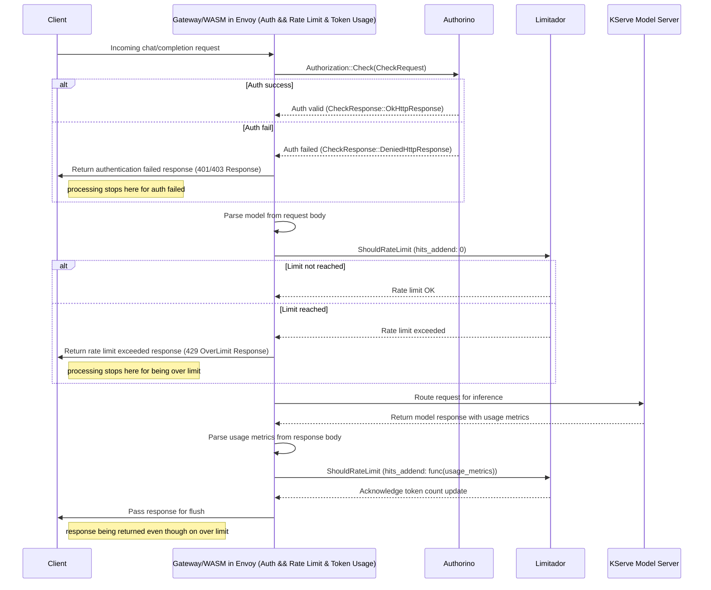
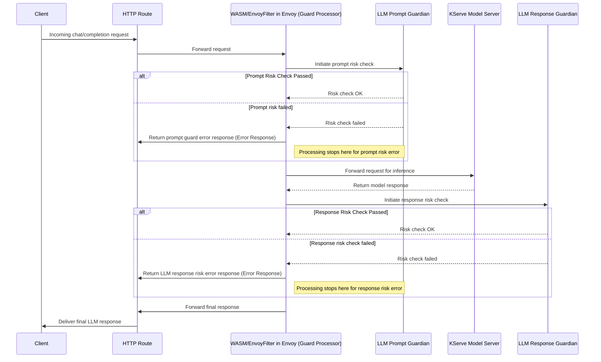

# AI Policies

- Feature Name: `ai_policies`
- Start Date: 2025-04-08
- RFC PR: [Kuadrant/architecture#120](https://github.com/Kuadrant/architecture/pull/120)
- Issue tracking: [Kuadrant/architecture#118](https://github.com/Kuadrant/architecture/issues/118)

# Summary
[summary]: #summary

AI workloads are becoming increasingly prominent, and there is significant momentum among several related Gateway API projects to provide policies and tooling for managing these workloads, from the perspectives of both platform engineering and the app developer.

This RFC proposes three new Kuadrant APIs in the general AI Gateway realm:

- `TokenRateLimitPolicy`
- `PromptGuardPolicy`
- `ResponseGuardPolicy`

# Motivation
[motivation]: #motivation

Why are we doing this? What use cases does it support? What is the expected outcome?

AI workloads are becoming extremely popular. Our policies can augment and enhance both the management of ingress traffic via the Gateway API and the routing to running model servers.
The aim is to augment, not replace, the [Gateway API Inference Extensions](https://gateway-api-inference-extension.sigs.k8s.io/) project.

Using the [Inference Platform Admin](https://github.com/kubernetes-sigs/gateway-api-inference-extension/tree/main/docs/proposals/002-api-proposal#inference-platform-admin) and [Inference Workload Owner](https://github.com/kubernetes-sigs/gateway-api-inference-extension/tree/main/docs/proposals/002-api-proposal#inference-workload-owner) personas, some high-level use-cases we hope to enable are:

- As an Inference Platform Admin, I want to protect my LLM infrastructure from being overwhelmed by limiting per user token usage across all models.
- As an Inference Workload Owner, I want to apply token usage limits to specific models so that costs are controlled based on the heaviest GPU using models.
- As an Inference Workload Owner, I want to apply different token usage limits to different user groups based on business requirements.
- As an Inference Workload Owner, I want to guard my running model servers from risky prompts (input) with a model such as [Granite Guardian](https://huggingface.co/ibm-granite/granite-guardian-3.1-2b), and reject them before they are routed to (expensive) running models
- As an Inference Workload Owner, I want to guard against risky chat completion responses (output) with a model such as [Granite Guardian](https://huggingface.co/ibm-granite/granite-guardian-3.1-2b)
- As an Inference Workload Owner, I want to apply guards against different risky content categories to different user groups based on business requirements.

# Guide-level explanation
[guide-level-explanation]: #guide-level-explanation

## New Policies

### `TokenRateLimitPolicy`

A Kuadrant `TokenRateLimitPolicy` is a custom resource provided by Kuadrant that targets Gateway API resources (`Gateway` and `HTTPRoute`) designed to allow users to define and enforce rate limiting rules to control token usage within OpenAI-style LLM provider APIs. It allows users to set and enforce token budget constraints for Gateways, but also for individual services exposed as HTTPRoutes. Per-user or per-group token rate limiting can be enforced based on JWT claims.


### `PromptGuardPolicy`

A Kuadrant `PromptGuardPolicy` is a custom resource provided by Kuadrant that targets Gateway API resources (`Gateway` and `HTTPRoute`), enabling users to define and enforce content safety rules with LLM prompts to detect and block sensitive prompts.  Prompt guards can be defined and enforced for both Gateways and individual HTTPRoutes.

### `ResponseGuardPolicy`

A Kuadrant `ResponseGuardPolicy` is a custom resource provided by Kuadrant that targets Gateway API resources (`Gateway` and `HTTPRoute`), enabling users to define and enforce content safety rules with LLM content completion responses, to detect and block sensitive responses from LLMs. These can be defined and enforced for both Gateways and individual HTTPRoutes.

## Concepts Introduced

- Token-based rate limiting: Controls usage by number of tokens, not just requests. Helps manage LLM costs.
- Prompt guarding: Filters risky or unwanted prompts before they hit model servers.
- Completion guarding: Reviews and filters model outputs before they're returned to users.

## Example Use Case

Say you're serving a chat LLM behind a Gateway, which implements an OpenAI-style chat `/completion` API. You want:

- Free-tier users limited to 20k tokens/day.
- Guardrails to reject prompts asking for harmful, violent or sexual content.
- Output filtering to block generally harmful completions.

You’d define the following policies and resources:

> Notes (somewhere): OpenAI-style usage metrics in responses required: `"usage":{"prompt_tokens":5,"total_tokens":15,"completion_tokens":10}`

```yaml
apiVersion: kuadrant.io/v1
kind: AuthPolicy
metadata:
  name: gold-users-auth
spec:
  targetRef:
    group: gateway.networking.k8s.io
    kind: Gateway
    name: my-llm-gateway
  rules:
    authorization:
      "gold-users":
        opa:
          rego: |
            groups := split(object.get(input.auth.identity.metadata.annotations, "kuadrant.io/groups", ""), ",")
            allow { groups[_] == "gold" }
---
apiVersion: kuadrant.io/v1
kind: AuthPolicy
metadata:
  name: free-users-auth
spec:
  targetRef:
    group: gateway.networking.k8s.io
    kind: Gateway
    name: my-llm-gateway
  rules:
    authorization:
      "free-users":
        opa:
          rego: |
            groups := split(object.get(input.auth.identity.metadata.annotations, "kuadrant.io/groups", ""), ",")
            allow { groups[_] == "free" }
---
apiVersion: v1
kind: Secret
metadata:
  name: api-key-free-user-1
    app: my-llm
  annotations:
    kuadrant.io/groups: free
    secret.kuadrant.io/user-id: user-1
stringData:
  api_key: iamafreeuser
type: Opaque
---
apiVersion: v1
kind: Secret
metadata:
  name: api-key-gold-user-1
    app: my-llm
  annotations:
    kuadrant.io/groups: gold
    secret.kuadrant.io/user-id: user-2
stringData:
  api_key: iamafreeuser
type: Opaque
---
apiVersion: kuadrant.io/v1alpha1
kind: TokenRateLimitPolicy
metadata:
  name: token-limits
  namespace: gateway-system
spec:
  targetRef:
    group: gateway.networking.k8s.io
    kind: Gateway
    name: my-llm-gateway
  limits:
    free:
      rates:
      - limit: 20000
        window: 1d
      predicate: 'request.auth.claims["kuadrant.io/groups"].split(",").exists(g, g == "free")'
      counter: auth.identity.userid
    gold:
      rates:
      - limit: 200000
        window: 1d
      predicate: 'request.auth.claims["kuadrant.io/groups"].split(",").exists(g, g == "gold")'
      counter: auth.identity.userid
---
apiVersion: kuadrant.io/v1alpha1
kind: PromptGuardPolicy
metadata:
  name: prompt-check
spec:
  model:
    url: http://huggingface-granite-guardian-default.example.com/v1
    apiKey:
      secretRef:
        name: granite-api-key
        key: token
  categories:
    - harm
    - violence
    - sexual_content
  response:
    unauthorized:
      headers:
        "content-type":
          value: application/json
      body:
        value: |
          {
            "error": "Unauthorized",
            "message": "Request prompt blocked by content policy."
          }
---
apiVersion: kuadrant.io/v1alpha1
kind: ResponseGuardPolicy
metadata:
  name: completion-check
spec:
  model:
    url: http://huggingface-granite-guardian-default.example.com/v1
    apiKey:
      secretRef:
        name: granite-api-key
        key: token
  categories:
    - harm
  response:
    forbidden:
      headers:
        "content-type":
          value: application/json
      body:
        value: |
          {
            "error": "Forbidden",
            "message": "Response blocked by content policy."
          }
```

## User Impact

- Existing users: These policies extend existing workflows. Policy attachment is the same; what's different is the semantics (tokens vs requests, prompt filtering, etc).
- New users: Can adopt Kuadrant to secure and manage LLM workloads from the start.

# Reference-level explanation
[reference-level-explanation]: #reference-level-explanation

## TokenRateLimitPolicy

- Add a new resource, `TokenRateLimitPolicy`, to be managed by the Kuadrant operator.
- Bring AI concepts into the new abstraction. For instance, token based rate limiting for some specific model.
- Expose cost strategies to be computed out of the existing token metrics. Basically this means that the user provides a function to compute the cost. Examples:
  - cost based on `prompt_tokens`
  - cost based on `prompt_tokens + completion_tokens`
  - cost based on weighted average `X * prompt_tokens + Y * completion_tokens`

### Data plane implications: new capabilities of the kuadrant's wasm module
- Give a means to specify a counter increment amount (currently, [hard-coded](https://github.com/Kuadrant/wasm-shim/blob/main/src/service/rate_limit.rs#L18) to `1`)
> Note: we should also look to offer the ability to pick a custom incrementor as part of our API for `RateLimitPolicy` users as well

The `data` section will have a broader purpose beyond just building descriptor entries.
The meaning and usage of data computed from this section will depend on the specific service it’s used for.
For rate limiting, data derived from the `data` section will be used to determine the *domain*, *hits_addend* value, and descriptor entries.
Currently, the `data` section has no use for authentication purposes.
However, this change lays the groundwork for including dynamic data that could be sent to Authorino (or other external authorization services) in the future.
When preparing rate-limiting data from the `data` section,
two reserved keys defined in the [well-known attributes](https://github.com/Kuadrant/architecture/blob/main/rfcs/0002-well-known-attributes.md#rate-limit-attributes)
*can optionally* be used: `ratelimit.domain` and `ratelimit.hits_addend`.
These keys cannot be reused as descriptor entry keys.
Specifying multiple values for either `ratelimit.domain` or `ratelimit.hits_addend` will result in an error and the configuration will be rejected.
If `ratelimit.hits_addend` is not specified in the `data` section, it defaults to `1`.
If `ratelimit.domain` is not specified in the `data` section,
the default value will be the one defined in the `scope` field of the action.

Example:

```yaml
actions:
- service: ratelimit-service
  scope: ratelimit-scope-a
  data:
    - expression:
        key: model
        value: requestBodyJSON('model')
    - expression:
        key: limit.low_limit__346b5e73
        value: "1"
    - expression:
        key: ratelimit.domain
        value: foobar
    - expression:
        key: ratelimit.hits_addend
        value: responseBodyJSON('usage.total_tokens')
```

When a prompt request for model `gpt-4.1`, whose response generates `35` tokens, reaches the WASM module with the configuration above,
it will result in the following [ShouldRateLimit gRPC](https://www.envoyproxy.io/docs/envoy/latest/api-v3/service/ratelimit/v3/rls.proto) call:

```json
{
  "domain": "foobar",
  "descriptors": [
      {
           "entries": [
               {"key": "model", "value": "gpt-4.1"},
               {"key": "limit.low_limit__346b5e73", "value": "1"}
           ]
      }
  ],
  "hits_addend": 35
}
```

- Implement the rate-limiting logic during the processing of the downstream request body, as it must be parsed to determine which model is being targeted.
  - Initial descriptors would include the request path, user id (if available) and the requested model.
- Implement the rate-limiting logic during the processing of the upstream response body, as it must be parsed to determine the counter increment based on usage metrics.
- The order of actions matters here, as usage metrics are flushed as part of the body of LLM responses (either complete responses, or when streamed). Some additional notes on our existing filters, including our "internal to WASM" http filter chain, in this thread: https://kubernetes.slack.com/archives/C05J0D0V525/p1744098001098719. A flow diagram below attempts to capture this flow at a high level.
- Look at ways to avoid 2 requests to limitador per single request to a model. This is not ideal to have a limit check and counter increment happen separately due to scaling concerns. However, this approach is sufficient for an initial implementation.
- A new action type is not being considered. The WASM module will only initiate a ShouldRateLimit gRPC call to Limitador when all associated CEL expressions (namely `predicates` and `data`) can be evaluated.
- If any of the CEL expression references the `requestBodyJSON()` CEL function, the gRPC request will be triggered after the downstream request body has been parsed.
- If any of the CEL expression references the `responseBodyJSON()` CEL function, the gRPC request will be triggered after the upstream response body has been parsed.
- The order of actions is important, but some specific scenarios must be considered:
  - If one action requires evaluation of the `requestBodyJSON()` and a subsequent action can be performed during the request headers phase, both actions will be executed during the request body phase.
  - If one action requires evaluation of the `responseBodyJSON()` and a subsequent action can be performed during the request headers phase, the order will not be enforced. As a result, the second action will be executed before the first.

## PromptGuardPolicy

- Add a new resource, `PromptGuardPolicy`, to be managed by the Kuadrant operator.
- Extend the `wasm-shim`, ammending the `actionSet` to optionally call a prompt guard filter implementation in an `ext-proc` service.
  - Only the request body phase needs to be handled by the `ext-proc` service.
- The `ext-proc` service contains all logic to parse the prompt from the request body and pass it to a configured guard model.

### Sequence Diagrams

Below are some sequence diagrams that attempt to capture some of these flows and interactions at a high level.

#### Sequence Diagram: Token rate limiting and auth



#### Sequence Diagram: Prompt and Completion Response Guarding



### Parsing OpenAI-style usage metrics

OpenAI-style usage metrics for both completion and response APIs generally have a `usage` object, with values for `prompt_tokens` (token count for the initial prompt), `completion_tokens` (tokens generated by the model in response) and `total_tokens` (prompt + response tokens count).

Many popular model servers implement "OpenAI-compatible" chat completion or response endpoints for inference. As part of this, they generally respond to inference requests with the above `usage` object. There are generally two popular modes of response (both over HTTP) - a complete response (wait for the in its entireity), or a streamed response (with HTTP chunking). Usage metrics are included out-of the box for complete responses generally, whereas with streamed responses usage metrics are in one of the chunks. Depending on the model runtime, streamed responses do not append usage metrics unless the initial prompt request includes:

```json
{"stream_options: {"include_usage": true}}
```

In streamed responses, `usage` metrics are included in either the second-to-last or last chunk in a response.

Given the permutations, this will add some extra complexity to how we parse usage metrics. There is a basic Golang example of an `ext_proc` that can parse these metrics (non-streamed responses) here: https://github.com/jasonmadigan/token-ext-proc

We will also want to support llama-stack style responses. Inference chat-completion with llama-stack offers the option for configurable (JSON-schema) guideded `response_format`. This may hint that we'll want to offer some customisation in terms of where to look for metrics, (probably CEL, or JQ-style querying?).

Below are some example completion/response responses:

#### Example `/completion` responses

We want to support both complete and streamed (HTTP chunked) responses from downstream.

[kServe HuggingFace model server](https://kserve.github.io/website/master/modelserving/v1beta1/llm/huggingface/text_generation/) completion response:

```json
{
  // ...
  "usage":{
    "prompt_tokens":5,
    "total_tokens":55,
    "completion_tokens":50,
    "prompt_tokens_details":null
  },
  //...
}
```

OpenAI `/v1/chat/completions` [response](https://platform.openai.com/docs/api-reference/responses/create):

Complete:
```json
{
  // ..
  "usage": {
    "prompt_tokens": 19,
    "completion_tokens": 10,
    "total_tokens": 29,
    "prompt_tokens_details": {
      "cached_tokens": 0,
      "audio_tokens": 0
    },
    "completion_tokens_details": {
      "reasoning_tokens": 0,
      "audio_tokens": 0,
      "accepted_prediction_tokens": 0,
      "rejected_prediction_tokens": 0
    }
  }
  // ...
}
```

Streamed (second-to-last chunk):
```json
{
  "id": "chatcmpl-9M3...",
  "choices": [],
  "created": 1715044805,
  "model": "gpt-3.5-turbo-0125",
  "object": "chat.completion.chunk",
  "system_fingerprint": null,
  "usage": {
    "completion_tokens": 11,
    "prompt_tokens": 29,
    "total_tokens": 40
  }
}
{
  "id": "chatcmpl-9M3...",
  "choices": [
    {
      "delta": {
        "content": null,
        "function_call": null,
        "role": null,
        "tool_calls": null
      },
      "finish_reason": "stop",
      "index": 0,
      "logprobs": null
    }
  ],
  "created": 1715044805,
  "model": "gpt-3.5-turbo-0125",
  "object": "chat.completion.chunk",
  "system_fingerprint": null,
  "usage": null
}
```

Streamed:

Ref: https://community.openai.com/t/usage-stats-now-available-when-using-streaming-with-the-chat-completions-api-or-completions-api/738156

OpenAI `/v1/responses` [response](https://platform.openai.com/docs/api-reference/chat/create):

Complete:
```json
{
  // ..
 "usage": {
    "input_tokens": 36,
    "input_tokens_details": {
      "cached_tokens": 0
    },
    "output_tokens": 87,
    "output_tokens_details": {
      "reasoning_tokens": 0
    },
    "total_tokens": 123
  },
  // ...
}
```

Streamed:

```json
event: response.completed
data: {"type":"response.completed","response":{"id":"resp_67c9fdcecf488190bdd9a0409de3a1ec07b8b0ad4e5eb654","object":"response","created_at":1741290958,"status":"completed","error":null,"incomplete_details":null,"instructions":"You are a helpful assistant.","max_output_tokens":null,"model":"gpt-4o-2024-08-06","output":[{"id":"msg_67c9fdcf37fc8190ba82116e33fb28c507b8b0ad4e5eb654","type":"message","status":"completed","role":"assistant","content":[{"type":"output_text","text":"Hi there! How can I assist you today?","annotations":[]}]}],"parallel_tool_calls":true,"previous_response_id":null,"reasoning":{"effort":null,"generate_summary":null},"store":true,"temperature":1.0,"text":{"format":{"type":"text"}},"tool_choice":"auto","tools":[],"top_p":1.0,"truncation":"disabled","usage":{"input_tokens":37,"output_tokens":11,"output_tokens_details":{"reasoning_tokens":0},"total_tokens":48},"user":null,"metadata":{}}}
```

```json
{
  // ...
  "usage":{"input_tokens":37,"output_tokens":11,"output_tokens_details":{"reasoning_tokens":0},"total_tokens":48}
  // ...
}
```


# Drawbacks
[drawbacks]: #drawbacks

Why should we *not* do this?

# Rationale and alternatives
[rationale-and-alternatives]: #rationale-and-alternatives

- Why is this design the best in the space of possible designs?
- What other designs have been considered and what is the rationale for not choosing them?
- What is the impact of not doing this?

# Prior art
[prior-art]: #prior-art

Discuss prior art, both the good and the bad, in relation to this proposal.
A few examples of what this can include are:

- Does another project have a similar feature?
- What can be learned from it? What's good? What's less optimal?
- Papers: Are there any published papers or great posts that discuss this? If you have some relevant papers to refer to, this can serve as a more detailed theoretical background.

This section is intended to encourage you as an author to think about the lessons from other tentatives - successful or not, provide readers of your RFC with a fuller picture.

Note that while precedent set by other projects is some motivation, it does not on its own motivate an RFC.

# Unresolved questions
[unresolved-questions]: #unresolved-questions

- What parts of the design do you expect to resolve through the RFC process before this gets merged?
- What parts of the design do you expect to resolve through the implementation of this feature before stabilization?
- What related issues do you consider out of scope for this RFC that could be addressed in the future independently of the solution that comes out of this RFC?

# Future possibilities
[future-possibilities]: #future-possibilities

- With `TokenRateLimitPolicy`, we're looking to extend support to provide a custom incrementor. Given the change will be in the same path as `RateLimitPolicy`, we should look to offer similar support for that policy.
