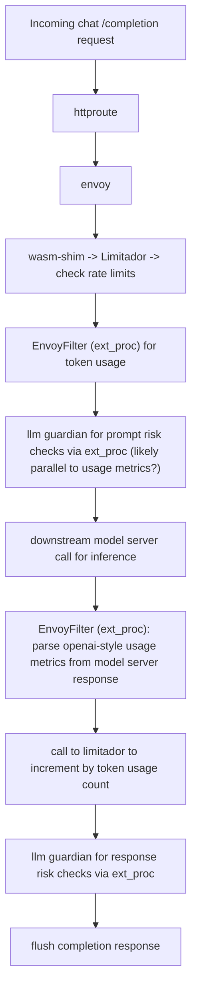

# RFC Template

- Feature Name: `ai_policies`
- Start Date: (fill me in with today's date, YYYY-MM-DD)
- RFC PR: [Kuadrant/architecture#0013](https://github.com/Kuadrant/architecture/pull/0000)
- Issue tracking: [Kuadrant/architecture#0000](https://github.com/Kuadrant/architecture/issues/0000)

# Summary
[summary]: #summary

AI workloads are becoming increasingly prominent, and there is significant momentum among several related Gateway API projects to provide policies and tooling for managing these workloads, from the perspectives of both platform engineering and the app developer.

This RFC proposes three new Kuadrant APIs in the general AI Gateway realm:

- `LLMTokenRateLimitPolicy` (alts: `TokenRateLimitPolicy`)
- `LLMPromptRiskCheckPolicy` (alts: `PromptGuardPolicy`, `PromptSafetyPolicy`, `PromptFilterPolicy`)
- `LLMResponseRiskCheckPolicy` (alts: `CompletionGuardPolicy`, `CompletionSafetyPolicy`)

# Motivation
[motivation]: #motivation

Why are we doing this? What use cases does it support? What is the expected outcome?

AI workloads are becoming extremely popular. Our policies can augment and enhance both the management of ingress traffic via the Gateway API and the routing to running model servers.
The aim is to augment, not replace, the [Gateway API Inference Extensions](https://gateway-api-inference-extension.sigs.k8s.io/) project.

Using the [Inference Platform Admin](https://github.com/kubernetes-sigs/gateway-api-inference-extension/tree/main/docs/proposals/002-api-proposal#inference-platform-admin) and [Inference Workload Owner](https://github.com/kubernetes-sigs/gateway-api-inference-extension/tree/main/docs/proposals/002-api-proposal#inference-workload-owner) personas, some high-level use-cases we hope to enable are:

- As an Inference Platform Admin, I want to protect my LLM infrastructure from being overwhelmed by limiting per user token usage across all models.
- As an Inference Workload Owner, I want to apply token usage limits to specific models so that costs are controlled based on the heaviest GPU using models.
- As an Inference Workload Owner, I want to apply different token usage limits to different user groups based on business requirements.
- As an Inference Workload Owner, I want to guard my running model servers from risky prompts (input) with a model such as [Granite Guardian](https://huggingface.co/ibm-granite/granite-guardian-3.1-2b), and reject them before they are routed to (expensive) running models
- As an Inference Workload Owner, I want to guard against risky chat completion responses (output) with a model such as [Granite Guardian](https://huggingface.co/ibm-granite/granite-guardian-3.1-2b)
- As an Inference Workload Owner, I want to apply guards against different risky content categories to different user groups based on business requirements.

# Guide-level explanation
[guide-level-explanation]: #guide-level-explanation

## New Policies

### `LLMTokenRateLimitPolicy`

A Kuadrant `LLMTokenRateLimitPolicy` is a custom resource provided by Kuadrant that targets Gateway API resources (`Gateway` and `HTTPRoute`) designed to allow users to define and enforce rate limiting rules to control token usage within OpenAI-style LLM provider APIs. It allows users to set and enforce token budget constraints for Gateways, but also for individual services exposed as HTTPRoutes. Per-user or per-group token rate limiting can be enforced based on JWT claims.


### `LLMPromptRiskCheckPolicy`

A Kuadrant `LLMPromptRiskCheckPolicy` is a custom resource provided by Kuadrant that targets Gateway API resources (`Gateway` and `HTTPRoute`), enabling users to define and enforce content safety rules with LLM prompts to detect and block sensitive prompts.  Prompt guards can be defined and enforced for both Gateways and individual HTTPRoutes.

### `LLMResponseRiskCheckPolicy`

A Kuadrant `LLMResponseRiskCheckPolicy` is a custom resource provided by Kuadrant that targets Gateway API resources (`Gateway` and `HTTPRoute`), enabling users to define and enforce content safety rules with LLM content completion responses, to detect and block sensitive responses from LLMs. These can be defined and enforced for both Gateways and individual HTTPRoutes.

## Concepts Introduced

- Token-based rate limiting: Controls usage by number of tokens, not just requests. Helps manage LLM costs.
- Prompt guarding: Filters risky or unwanted prompts before they hit model servers.
- Completion guarding: Reviews and filters model outputs before they're returned to users.

## Example Use Case


Say you're serving a chat LLM behind a Gateway, which implements an OpenAI-style chat `/completion` API. You want:

- Free-tier users limited to 20k tokens/day.
- Guardrails to reject prompts asking for harmful, violent or sexual content.
- Output filtering to block generally harmful completions.

You’d define the following policies:

> Notes (somewhere): OpenAI-style usage metrics in responses required: `"usage":{"prompt_tokens":5,"total_tokens":15,"completion_tokens":10}`

```yaml
apiVersion: kuadrant.io/v1alpha1
kind: LLMTokenRateLimitPolicy
metadata:
  name: token-limit-free
spec:
  targetRef:
    group: gateway.networking.k8s.io
    kind: Gateway
    name: my-llm-gateway
  limit:
    rate:
      limit: 20000
      window: 1d
    predicate: 'request.auth.claims["kuadrant.io/groups"].split(",").exists(g, g == "free")' 
    counter: auth.identity.userid
```

```yaml
apiVersion: kuadrant.io/v1alpha1
kind: LLMPromptRiskCheckPolicy
metadata:
  name: prompt-check
spec:
  model:
    url: http://huggingface-granite-guardian-default.example.com/v1
    apiKey:
      secretRef:
        name: granite-api-key
        key: token
  categories:
    - harm
    - violence
    - sexual_content
  response:
    unauthorized:
      headers:
        "content-type":
          value: application/json
      body:
        value: |
          {
            "error": "Unauthorized",
            "message": "Request prompt blocked by content policy."
          }
```

```yaml
apiVersion: kuadrant.io/v1alpha1
kind: LLMResponseRiskCheckPolicy
metadata:
  name: completion-check
spec:
  model:
    url: http://huggingface-granite-guardian-default.example.com/v1
    apiKey:
      secretRef:
        name: granite-api-key
        key: token
  categories:
    - harm
  response:
    forbidden:
      headers:
        "content-type":
          value: application/json
      body:
        value: |
          {
            "error": "Forbidden",
            "message": "Response blocked by content policy."
          }
```

## User Impact

- Existing users: These policies extend existing workflows. Policy attachment is the same; what's different is the semantics (tokens vs requests, prompt filtering, etc).
- New users: Can adopt Kuadrant to secure and manage LLM workloads from the start.

# Reference-level explanation
[reference-level-explanation]: #reference-level-explanation

This is the technical portion of the RFC. Explain the design in sufficient detail that:

- Its interaction with other features is clear.
- It is reasonably clear how the feature would be implemented.
- How error would be reported to the users.
- Corner cases are dissected by example.

The section should return to the examples given in the previous section, and explain more fully how the detailed proposal makes those examples work.


## `LLMTokenRateLimitPolicy`

- Add a new resource, `LLMTokenRateLimitPolicy`, to be managed by the Kuadrant operator.
- Either:
  - Extend our existing `wasm-shim` to optionally amend the existing `actionSet` to optionally call both the guard filter and the token parsing filter implementation.
  - Create a new `ext_proc` gRPC service for parsing OpenAI-style and usage metrics and adding these as well-known dynamic metadata, for use by Limitador
- Extend the wasm-chim and `RateLimitPolicy` to give a means to specify an increment (currently, [hard-coded](https://github.com/Kuadrant/wasm-shim/blob/main/src/service/rate_limit.rs#L18) to `1`)
- Alter the wasm-shim's `actionSets` actions to inject (where appropriate) additional steps for both guards and token usage metrics parsing. The order of actions matters here, as usage metrics are flushed as part of the body of LLM responses (either complete responses, or when streamed). Some additional notes on our existing filters, including our"internal to WASM" http filter chain, in this thread: https://kubernetes.slack.com/archives/C05J0D0V525/p1744098001098719. A flow diagram below attempts to capture this flow at a high level.
- Look at ways to support a "two-phase" approach to rate-limiting: a standard, normal rate limit enforcement prior to hitting the model server (responding early if limited), and (if not limited) one after based on one to increment counters by a custom increment (after parsing usage metrics)

A diagram:




### Parsing OpenAI-style usage metrics

OpenAI-style usage metrics for both completion and response APIs generally have a `usage` object, with values for `prompt_tokens` (token count for the initial prompt), `completion_tokens` (tokens generated by the model in response) and `total_tokens` (prompt + response tokens count).

Many popular model servers implement "OpenAI-compatible" chat completion or response endpoints for inference. As part of this, they generally respond to inference requests with the above `usage` object. There are generally two popular modes of response (both over HTTP) - a complete response (wait for the in its entireity), or a streamed response (with HTTP chunking). Usage metrics are included out-of the box for complete responses generally, whereas with streamed responses usage metrics are in one of the chunks. Depending on the model runtime, streamed responses do not append usage metrics unless the initial prompt request includes:

```json
{"stream_options: {"include_usage": true}}
```

In streamed responses, `usage` metrics are included in either the second-to-last or last chunk in a response.

Given the permutations, this will add some extra complexity to how we parse usage metrics. There is a basic Golang example of an `ext_proc` that can parse these metrics (non-streamed responses) here: https://github.com/jasonmadigan/token-ext-proc

We will also want to support llama-stack style responses. Inference chat-completion with llama-stack offers the option for configurable (JSON-schema) guideded `response_format`. This may hint that we'll want to offer some customisation in terms of where to look for metrics, (probably CEL, or JQ-style querying?).

Below are some example completion/response responses:

#### Example `/completion` responses

We want to support both complete and streamed (HTTP chunked) responses from downstream.

[kServe HuggingFace model server](https://kserve.github.io/website/master/modelserving/v1beta1/llm/huggingface/text_generation/) completion response:

```json
{
  // ...
  "usage":{
    "prompt_tokens":5,
    "total_tokens":55,
    "completion_tokens":50,
    "prompt_tokens_details":null
  },
  //...
}
```

OpenAI `/v1/chat/completions` [response](https://platform.openai.com/docs/api-reference/responses/create):

Complete:
```json
{
  // ..
  "usage": {
    "prompt_tokens": 19,
    "completion_tokens": 10,
    "total_tokens": 29,
    "prompt_tokens_details": {
      "cached_tokens": 0,
      "audio_tokens": 0
    },
    "completion_tokens_details": {
      "reasoning_tokens": 0,
      "audio_tokens": 0,
      "accepted_prediction_tokens": 0,
      "rejected_prediction_tokens": 0
    }
  }
  // ...
}
```

Streamed (second-to-last chunk):
```json
{
  "id": "chatcmpl-9M3...",
  "choices": [],
  "created": 1715044805,
  "model": "gpt-3.5-turbo-0125",
  "object": "chat.completion.chunk",
  "system_fingerprint": null,
  "usage": {
    "completion_tokens": 11,
    "prompt_tokens": 29,
    "total_tokens": 40
  }
}
{
  "id": "chatcmpl-9M3...",
  "choices": [
    {
      "delta": {
        "content": null,
        "function_call": null,
        "role": null,
        "tool_calls": null
      },
      "finish_reason": "stop",
      "index": 0,
      "logprobs": null
    }
  ],
  "created": 1715044805,
  "model": "gpt-3.5-turbo-0125",
  "object": "chat.completion.chunk",
  "system_fingerprint": null,
  "usage": null
}
```

Streamed:

Ref: https://community.openai.com/t/usage-stats-now-available-when-using-streaming-with-the-chat-completions-api-or-completions-api/738156

OpenAI `/v1/responses` [response](https://platform.openai.com/docs/api-reference/chat/create):

Complete:
```json
{
  // ..
 "usage": {
    "input_tokens": 36,
    "input_tokens_details": {
      "cached_tokens": 0
    },
    "output_tokens": 87,
    "output_tokens_details": {
      "reasoning_tokens": 0
    },
    "total_tokens": 123
  },
  // ...
}
```

Streamed:

```json
event: response.completed
data: {"type":"response.completed","response":{"id":"resp_67c9fdcecf488190bdd9a0409de3a1ec07b8b0ad4e5eb654","object":"response","created_at":1741290958,"status":"completed","error":null,"incomplete_details":null,"instructions":"You are a helpful assistant.","max_output_tokens":null,"model":"gpt-4o-2024-08-06","output":[{"id":"msg_67c9fdcf37fc8190ba82116e33fb28c507b8b0ad4e5eb654","type":"message","status":"completed","role":"assistant","content":[{"type":"output_text","text":"Hi there! How can I assist you today?","annotations":[]}]}],"parallel_tool_calls":true,"previous_response_id":null,"reasoning":{"effort":null,"generate_summary":null},"store":true,"temperature":1.0,"text":{"format":{"type":"text"}},"tool_choice":"auto","tools":[],"top_p":1.0,"truncation":"disabled","usage":{"input_tokens":37,"output_tokens":11,"output_tokens_details":{"reasoning_tokens":0},"total_tokens":48},"user":null,"metadata":{}}}
```

```json
{
  // ...
  "usage":{"input_tokens":37,"output_tokens":11,"output_tokens_details":{"reasoning_tokens":0},"total_tokens":48}
  // ...
}
```


# Drawbacks
[drawbacks]: #drawbacks

Why should we *not* do this?

# Rationale and alternatives
[rationale-and-alternatives]: #rationale-and-alternatives

- Why is this design the best in the space of possible designs?
- What other designs have been considered and what is the rationale for not choosing them?
- What is the impact of not doing this?

# Prior art
[prior-art]: #prior-art

Discuss prior art, both the good and the bad, in relation to this proposal.
A few examples of what this can include are:

- Does another project have a similar feature?
- What can be learned from it? What's good? What's less optimal?
- Papers: Are there any published papers or great posts that discuss this? If you have some relevant papers to refer to, this can serve as a more detailed theoretical background.

This section is intended to encourage you as an author to think about the lessons from other tentatives - successful or not, provide readers of your RFC with a fuller picture.

Note that while precedent set by other projects is some motivation, it does not on its own motivate an RFC.

# Unresolved questions
[unresolved-questions]: #unresolved-questions

- What parts of the design do you expect to resolve through the RFC process before this gets merged?
- What parts of the design do you expect to resolve through the implementation of this feature before stabilization?
- What related issues do you consider out of scope for this RFC that could be addressed in the future independently of the solution that comes out of this RFC?

# Future possibilities
[future-possibilities]: #future-possibilities

Think about what the natural extension and evolution of your proposal would be and how it would affect the platform and project as a whole. Try to use this section as a tool to further consider all possible interactions with the project and its components in your proposal. Also consider how this all fits into the roadmap for the project and of the relevant sub-team.

This is also a good place to "dump ideas", if they are out of scope for the RFC you are writing but otherwise related.

Note that having something written down in the future-possibilities section is not a reason to accept the current or a future RFC; such notes should be in the section on motivation or rationale in this or subsequent RFCs. The section merely provides additional information.