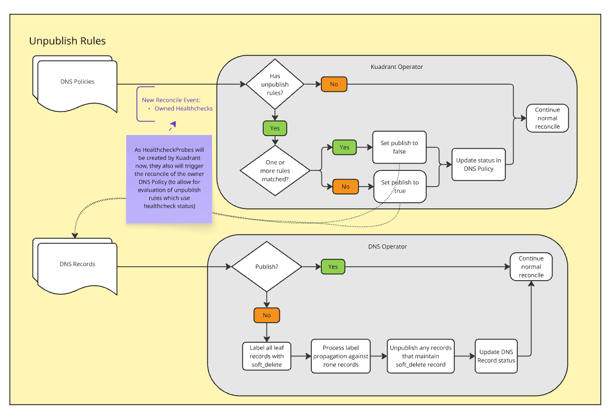
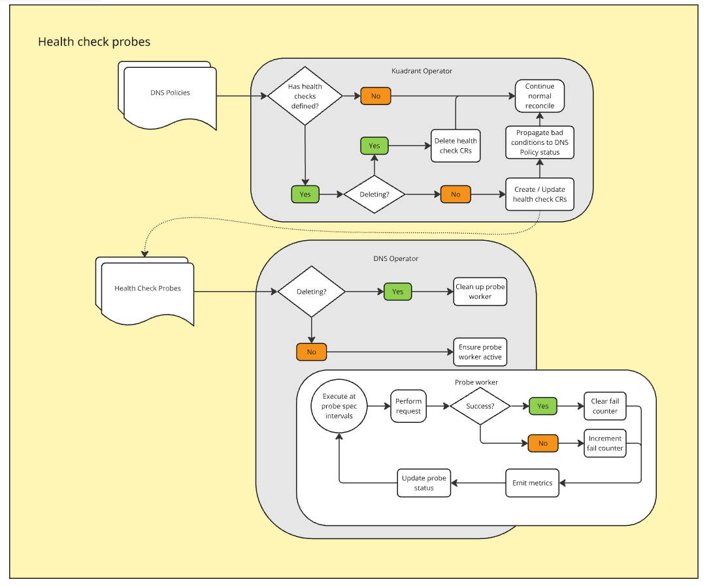

## Why
Currently there is no way to instruct the Kuadrant Operator to publish or unpublish a DNS Record when certain conditions are met, this means that conditionally removing a DNS Record requires manual intervention and an understanding of the internal workings of the DNS-Operator.

### Some Example Use Cases
- DNS Failover (rapidly switch to alternative DNS Configuration) to a secondary site
- Workload migration (removing workload from one cluster in favour of a new cluster)

## What
Add optional `unpublish` rules to the dns policy CRD, which will allow an administrator to define one or more rules which when satisfied will instruct the Kuadrant Operator to unpublish the records from the zone and see the results in a condition in the status of the policy.

## How

### Dependencies

The [soft_delete](https://github.com/Kuadrant/dns-operator/issues/356) feature is required.

### Diagrams

#### Unpublish diagram


#### Health check changes diagram
There are some changes to the health check probes also, below is a diagram showing how they will function once complete.



https://miro.com/app/board/uXjVL32kOMY=/

### CRD Updates
#### DNS Record

The DNS Record will no longer have a health check section in the spec.

It will also have a new field in the spec `publish` if set to false the DNS Operator will attempt to lazily (i.e. not greedily) remove the DNS Records from the zone without interfering with other controllers records and without causing the potential for an NXDomain response. If set to true it will attempt to publish the endpoints to the zone as usual.

#### DNS Policy
The DNS Policy will have a new field added to their spec:

```yaml
unpublish:
  when:
    <rule implemented using Common Expression Language>
    <rule implemented using Common Expression Language>
    <rule implemented using Common Expression Language>
```
### Kuadrant and DNS Operator operator changes

### Health check probe creation
The health checks are currently created by the DNS Operator, this will instead be moved to the Kuadrant-operator and the health checks will be owned by the DNS Policy that defined them, this section will no longer be copied to the DNS Record. They will continue to be reconciled by the DNS Operator and have the probes executed by the DNS Operator.

### Unpublish process - Kuadrant operator

The Kuadrant Operator will have the option to set the publish field in the spec of the DNS Record to false. When set to false the DNS Operator will attempt to remove that endpoint from the DNS Provider, unless doing so would result in a NXDOMAIN response from the provider. The DNS Operator will also add information to the status of the DNS Record regarding the result (e.g. unpublished, preserved to avoid NXDOMAIN or preserved to avoid removing an entire GEO).

When any unpublish rule evaluates to true, the kuadrant-operator will set publish to false on relevant DNS Records and add a condition to the status of the DNS Policy that the label was added due to a matched rule, and if the status is available in the DNS Record regarding the result of adding the label, this will also be propagated to the DNS Policy status.

### Unpublish process - DNS Operator

When a DNS Record is reconciled with the publish field set to false, the DNS Operator will apply the soft_delete label to the leaf records of that DNS Record (i.e. expect them to be removed if possible).

The soft_delete label [ticket here](https://github.com/Kuadrant/dns-operator/issues/356) will compute the minimum set of records required to be deleted to ensure that these labelled records are cleanly removed with out leaving any dead ends (e.g. a weighted hostname whose targets don't have records), and ensuring no potential NXDomains.

### Available CEL Fields

To begin with a few basic fields will be made available, although this could potentially expand in the future.
- records: The set of related DNS Record CRs for this DNS Policy
- healthchecks: The set of related DNSHealthCheckProbe CRs for this DNS Policy

## Use cases expanded
### DNS Failover
To enact DNS Failover with this config, the rule for publishing could be set to "when all other records are marked as unhealthy".

#### Example
Cluster 1 has no unpublishing rule (i.e. always)
Cluster 2 unpublishing rule is: "healthy_record_count - my_record_count > 0"

- Cluster 1 is currently published and healthy and cluster 2 has no published records.
- An event occurs that causes the workload to begin malfunctioning on cluster 1.
- All the records for cluster 1 are marked as unhealthy in the registry (but not removed as they are the only records available)
- cluster 2 reconciles and sees that all the records currently in the zone are unhealthy, as this negates it's unpublishing rule, it publishes it's records
- cluster 1 reconciles and sees there are records other than it's own and so unpublishes it's own records due to being unhealthy
- eventually cluster 1 is healthy again and republishes it's records
- cluster 2 sees that it's unpublishing rule is satisfied and so unpublishes it's own records.

### Workload migration
Cluster 1 has a workload that needs to be migrated to cluster 2.
- unpublishing rule on cluster 1 is set to: "unowned_record_count > 0"
- workload is created on cluster 2
- records created by cluster 2
- cluster 1 sees other records exist and unpublishes it's records from the zone
- admin sees the status updated on the DNS Policy in cluster 1 (all records removed from zone) happened more than the TTL ago
- admin can safely remove the workload from cluster 1.
