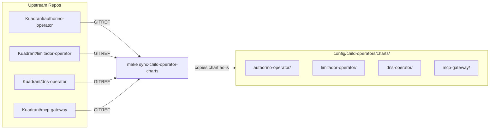
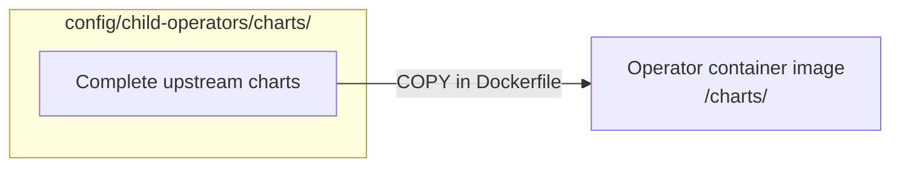
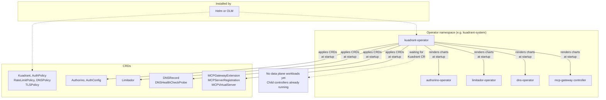
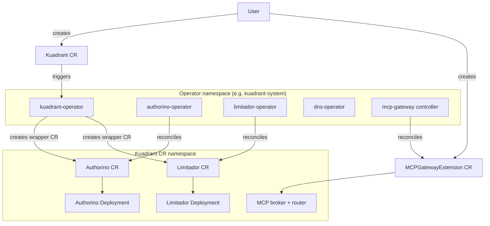
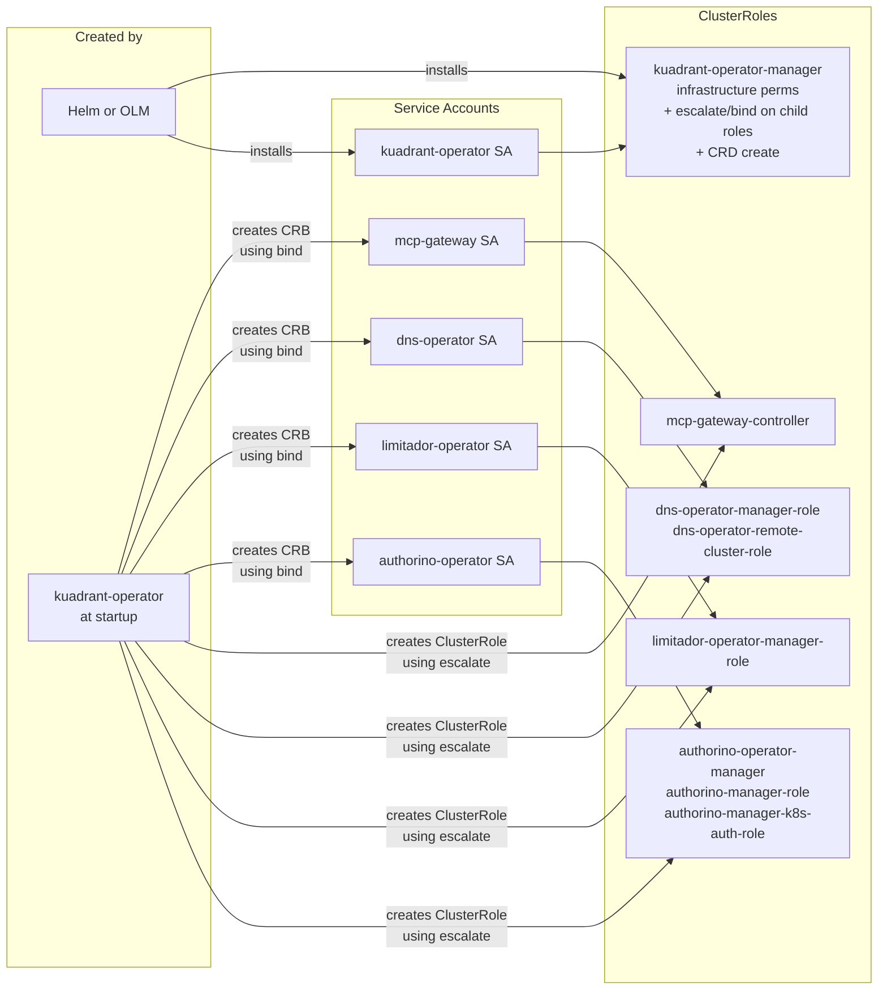
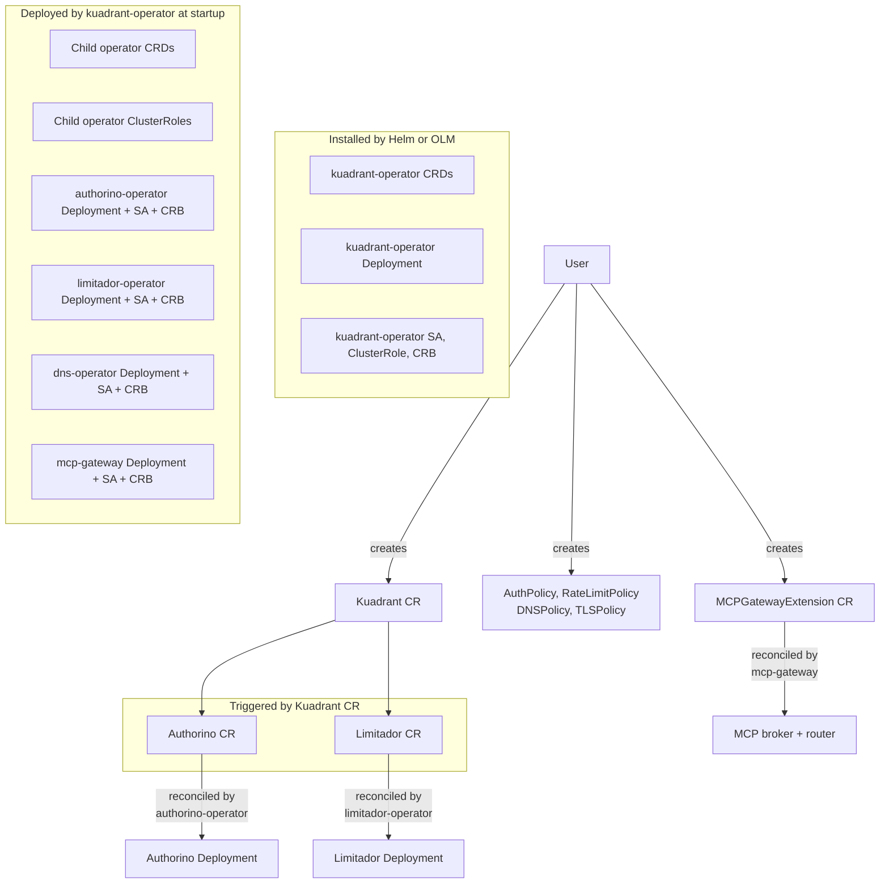

# Kuadrant Operator Consolidation: Architecture Diagrams

## Key

| Term | Meaning |
|------|---------|
| **SSA** | Server-Side Apply, the Kubernetes apply method where the server tracks field ownership per manager |
| **CRB** | ClusterRoleBinding |
| **SA** | ServiceAccount |
| **CRD** | CustomResourceDefinition |
| **escalate** | RBAC verb that allows creating ClusterRoles with permissions the creator does not hold |
| **bind** | RBAC verb that allows creating ClusterRoleBindings to ClusterRoles whose permissions the creator does not hold |
| **GITREF** | Git reference (branch, tag, or SHA) used to pull charts from upstream repos |
| **Wrapper CR** | Authorino/Limitador custom resources created by kuadrant-operator and reconciled by child operators |

## Build-Time: Chart Sync and Packaging

Charts are copied unmodified from upstream repos. No rendering, splitting, or classification at sync time. Each chart directory contains the complete upstream chart (Chart.yaml, values.yaml, templates/, crds/).

The kuadrant-operator OLM bundle and Helm chart contain only the kuadrant-operator's own resources (CRDs, Deployment, RBAC). Child operator resources are not included in the bundle or Helm chart.

## Cluster State After Installation (before Kuadrant CR)

All child operator controllers, CRDs, and ClusterRoles are deployed at operator startup before the controller manager begins watching resources. No Kuadrant CR is needed for the control plane to be running.

## Runtime: Reconciliation Chain

Child operator controllers are already running in the operator namespace (deployed at startup). When a user creates a Kuadrant CR, kuadrant-operator creates wrapper CRs (Authorino CR, Limitador CR) in the Kuadrant CR's namespace. The child operators reconcile these into data plane workloads. MCPGatewayExtension is created directly by the user.

## RBAC Model

The installer (Helm or OLM) only installs the kuadrant-operator's own SA, ClusterRole, and CRB. All child operator ClusterRoles, SAs, and CRBs are created by the kuadrant-operator at startup using `escalate` (to create ClusterRoles with permissions it does not hold) and `bind` (to create CRBs referencing those ClusterRoles).

## Resource Ownership

Three layers of resource ownership:
1. **Installer** (Helm/OLM): kuadrant-operator's own resources only
2. **kuadrant-operator at startup**: child operator CRDs, ClusterRoles, controllers (not tied to any CR)
3. **kuadrant-operator via Kuadrant CR**: wrapper CRs that trigger data plane workloads
