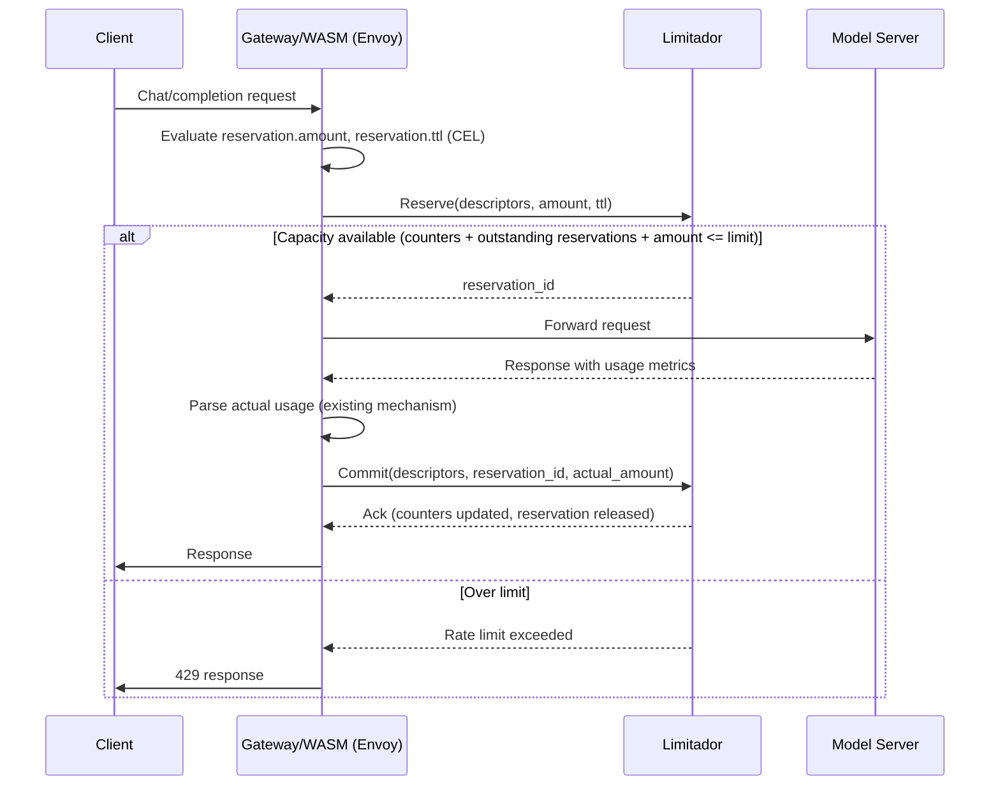

# Token Rate Limit Reservations

- Feature Name: `token_rate_limit_reservations`
- Status: Draft
- Start Date: 2026-07-20
- RFC PR: [Kuadrant/architecture#190](https://github.com/Kuadrant/architecture/pull/190)
- Original spec: [TokenRateLimitPolicy GA](https://docs.google.com/document/d/1Lmy52cZZuteJj8cxVNEcC5q59YYB2MV74naGKpkweds/edit?tab=t.0#heading=h.803yw4a9qwi9)

# Summary

`TokenRateLimitPolicy` ([RFC 0013](./0013-ai-policies.md)) checks capacity when a request arrives but only reports actual token usage after the model responds, which lets concurrent in-flight requests race past a limit before any of them report usage. This RFC introduces a **reservation layer** in Limitador: on arrival, an estimated token volume is reserved and held (with a TTL) against a limit's capacity; when the response comes back, the caller commits the reservation with actual usage in a single call, releasing any over-reservation immediately. Rejection semantics, rate-limit headers, and multi-limit all-or-nothing behavior are unchanged. The feature is additive at every layer (new gRPC RPCs, new CRD field, new Limitador flag) and is enabled by default, with an explicit `CheckReport` mode to revert to today's behavior.

# Motivation

RFC 0013 already called this out as a known limitation of the initial implementation:

> Look at ways to avoid 2 requests to limitador per single request to a model. This is not ideal to have a limit check and counter increment happen separately due to scaling concerns. However, this approach is sufficient for an initial implementation.

Concretely, today's flow is:

1. Request arrives → wasm-shim calls `CheckRateLimit` with `hits_addend=0` (pure read).
2. Request is forwarded to the model, which may take seconds.
3. Response arrives → wasm-shim calls `Report` with `hits_addend=<actual tokens>`.

Nothing holds capacity between steps 1 and 3. If N requests arrive concurrently, all N pass step 1 (counter is still at its pre-request value), and only after each of their (slow, variable-latency) model calls returns does the counter actually increment. A limit intended to cap usage at X tokens/window can be exceeded by an unbounded multiple of X, bounded only by how many requests happen to be in flight.

This race window widens further on an **Egress gateway**, where the model server is a third-party upstream outside the cluster rather than a colocated in-cluster deployment. Longer and more variable RTTs to an external upstream mean more time elapses between steps 1 and 3, giving concurrent requests a wider window to race past a limit before any of them report usage. Making the reservation layer proportionally more valuable in that setup.

This is a correctness gap that needs to close before `TokenRateLimitPolicy` can be called GA. The goal of this RFC is to close it without changing anything for existing users: default behavior gets safer automatically, the old behavior remains available as an explicit choice, and nothing about `RateLimitPolicy` or the standard Envoy RLS path is touched.

# Guide-level explanation

Rejections, `429` responses, rate-limit headers, and how multiple limits interact are unaffected by anything below. The only behavioral difference anyone sees is that concurrent requests can no longer race past a limit.

## For platform engineers

Nothing has to change. On a cluster running a compatible Limitador and operator, every `TokenRateLimitPolicy` automatically starts holding capacity for the estimated token cost of a request the moment it arrives, instead of only accounting for it after the model responds. No CR edits or policy edits required to get this protection.

The one new thing available is a **cluster-wide mode switch**, on the `Kuadrant` CR:

```yaml
apiVersion: kuadrant.io/v1beta1
kind: Kuadrant
spec:
  tokenRateLimiting:
    mode: Reservation   # default; set to CheckReport to revert every
                         # TokenRateLimitPolicy in the cluster to today's
                         # check/report behavior
```

## For policy owners

A new, optional per-limit `reservation` block on `TokenRateLimitPolicy` lets you control how much to reserve and for how long, using CEL.

```yaml
apiVersion: kuadrant.io/v1alpha1
kind: TokenRateLimitPolicy
metadata:
  name: token-limits
spec:
  targetRef:
    group: gateway.networking.k8s.io
    kind: Gateway
    name: my-llm-gateway
  limits:
    free:
      when:
      - predicate: 'request.auth.claims["kuadrant.io/groups"].split(",").exists(g, g == "free")'
      rates:
      - limit: 20000
        window: 1d
      counters:
      - expression: auth.identity.userid
      reservation:
        # estimated tokens to hold before the model responds
        amount: "uint(2000)"
        # how long to hold it before automatically releasing it
        ttl: "duration('30s')"
```

### Defaults for policies that don't set `reservation`

`reservation` is optional, but a limit reserves *something* the moment this feature is active, including every `TokenRateLimitPolicy` that predates this RFC and has never set the field. The defaults are themselves plain CEL expressions, generated by the operator when the field is omitted. And only when it's genuinely omitted after defaults/overrides merging across the policy hierarchy.

- **Default `amount`**: a flat constant:

```
uint(5000)
```

Deriving this from the request's own `max_tokens` (a real, protocol-declared upper bound on completion length, rather than a heuristic estimate) would be preferable, but reading request body fields at the point `Reserve` needs to evaluate them isn't feasible today. See [Unresolved questions](#unresolved-questions).

- **Default `ttl`**: the route's own configured backend-request timeout (Gateway API `HTTPRoute.spec.rules[].timeouts.backendRequest`). A reservation only needs to outlive a request for as long as that request could legitimately still be in flight, and the gateway already has an opinion about that.

## What the flow looks like



If the model call fails, times out, or the gateway crashes before `Commit` is ever sent, the reservation simply expires on its own TTL and stops holding capacity. No cleanup call is required, and the counter itself is never touched by an expired reservation, so a failed request never costs quota. Relying on TTL expiry as the *only* reclamation path for failed requests has a cost under repeated failures; see [Security considerations](#security-considerations) for why the gateway should also commit proactively on the error path.

## Migration

Existing `TokenRateLimitPolicy` resources need no changes. They pick up the new default behavior automatically once both the operator and Limitador in the cluster support it.
The `RateLimitPolicy` (non-token) is entirely unaffected; it does not go through any of the code paths this RFC touches.

### A de facto per-limit switch: `reservation.amount: 0`

Setting a limit's `reservation.amount` to `0`, as a literal or as the result of its CEL expression for some/all requests, is effectively a way to disable reservations for that one limit, without any new API surface. `Reserve` still gets called and still runs the same admission check (`counter.value + outstanding(counter) + 0 <= limit`), but since nothing is held, that limit gets none of the race-closing protection from [Motivation](#motivation): behaviorally identical, for that limit, to today's `CheckRateLimit(hits_addend=0)`.

This is meaningfully different from the cluster-wide `mode` switch, and the difference matters operationally:

- `mode: CheckReport` on the `Kuadrant` CR removes reliance on the reservation machinery entirely: the operator generates the old `Check`/`Report` wasm actions, and `Reserve`/`Commit` are never called for any policy in the cluster.
- `reservation.amount: 0` on a limit still fully exercises the reservation machinery: a `Reserve` call is made, a `ReservationEntry` with `amount: 0` is created and tracked in the per-counter registry, and `Commit` still looks it up and removes it. Only the *quantity* held is zero.

So if a critical issue is ever found in the reservation machinery itself (the registry, TTL/expiry logic, the `Reserve`/`Commit` RPCs), setting every limit's `amount` to `0` does not route around it. `mode: CheckReport` is the only switch that actually does. `reservation.amount: 0` is a per-limit "don't hold capacity for this limit" knob, not a kill switch for the reservation feature.

[Future possibilities](#future-possibilities) proposes a per-`TokenRateLimitPolicy` override of `mode` as well.

# Reference-level explanation

## Limitador

### Reservation entry and per-counter registry

A reservation is tracked **per counter**, not as one shared record referencing many counters. This matters because a single `TokenRateLimitPolicy` limit can resolve to multiple counters with different window lengths (e.g. a per-minute and a per-day rate on the same limit), and each counter's hold should expire independently, bounded by that counter's own window.

```text
// Registry: one list of outstanding reservations per counter identity
// (limit, set_variables) -- the same identity Counter already uses today.
CounterReservationRegistry: CounterKey -> [ReservationEntry]

// A single outstanding hold against one counter.
ReservationEntry {
    reservation_id: ReservationId  // opaque; the SAME id is stored under every
                                    // counter this reservation touched, so one
                                    // token released by the caller settles all
                                    // of them in a single Commit call
    amount:         u64            // estimated tokens reserved, uniform across
                                    // every counter this reservation touched
    expires_at:     Timestamp      // see "TTL and expiry" below
}

// Capacity available for a counter must now account for outstanding holds:
outstanding(counter) = sum(e.amount for e in registry[counter] if e.expires_at > now)
admit if counter.value + outstanding(counter) + requested_amount <= limit
```

`ReservationId` is an opaque handle from the caller's point of view (e.g. a UUID).

### TTL and expiry

A reservation's `expires_at`, computed independently **for each counter it touches**, is:

```text
expires_at(counter) = min(
    now + reservation.ttl,           // caller-supplied TTL (CEL-computed, see above)
    current_window_expiry(counter),  // this counter's own window boundary
    now + max_reservation_ttl        // operator-configured safety clamp
)
```

Clamping to the counter's own window boundary is what prevents a reservation from bleeding into the *next* window if the model call outlives the current window. A counter with no prior writes gets its window initialized by `Reserve`.

`max_reservation_ttl` is a new server-level flag, `--max-reservation-ttl` (default: `60s`), giving operators a hard ceiling on how long any single reservation can hold capacity regardless of what a policy's `reservation.ttl` CEL evaluates to, mirroring the role `--max-reservation-fraction` plays for `amount` below.

**Active reclamation** (memory/storage hygiene, not correctness):

- **In-memory backend**: a dedicated Moka cache for reservations using Moka's per-entry `Expiry` trait.
- **Redis backend**: reservation entries are hash field *values* (`amount` + `expires_at`) under a key per counter. A key-level `EXPIRE` on the hash reclaims one whose counters are never touched again.

### Reservation amount clamp

`reservation.amount` is a free-form CEL expression with no ceiling of its own: a single request can compute an arbitrarily large `amount`, and if admitted, that amount sits in `outstanding(counter)` for the full TTL, holding capacity back from every other request against that same counter for the duration. This gets the same treatment as TTL above: an operator-configured safety net layered on top of whatever the caller-supplied CEL produces, computed independently **per counter** (since `limit(counter)` can differ across the counters one reservation touches, e.g. a per-minute and a per-day rate on the same limit):

```text
requested_amount(counter) = min(
    caller_amount,                                     // caller CEL result
    limit(counter) * server_max_reservation_fraction   // operator-configured safety clamp
)
```

`server_max_reservation_fraction` is a new server-level flag, `--max-reservation-fraction` (default: `0.5`), expressed as a fraction of the counter's own limit rather than an absolute token count, so it scales automatically across limits of very different sizes without per-limit tuning. This is the `requested_amount` that feeds the admission check above and the value stored as `ReservationEntry.amount`; it is not necessarily identical across every counter a single reservation touches.

This clamp only affects what's held at `Reserve` time for admission purposes; `Commit` is unaffected and always applies the caller's real `actual_amount` unconditionally (see [`Commit` explained](#commit-explained)). The honest cost of the clamp: a single genuinely large request can be under-reserved relative to what it actually ends up consuming, and that gap only closes once `Commit` runs.

### New gRPC interface

Two new RPCs are added to the **existing** custom Kuadrant service:

```protobuf
service RateLimitService {
  // Unchanged. Existing behavior, existing message types, existing callers.
  rpc CheckRateLimit(RateLimitRequest) returns (RateLimitResponse);
  rpc Report(RateLimitRequest) returns (RateLimitResponse);

  // New. Additive only. No existing client ever calls these.
  rpc Reserve(ReserveRequest) returns (ReserveResponse);
  rpc Commit(CommitRequest) returns (CommitResponse);
}

message ReserveRequest {
  string domain = 1;                            // same as RateLimitRequest.domain today
  repeated RateLimitDescriptor descriptors = 2; // same descriptor shape as today
  uint64 amount = 3;
  google.protobuf.Duration ttl = 4;
}

message ReserveResponse {
  RateLimitResponse.Code code = 1;          // OK / OVER_LIMIT, same semantics as today
  string reservation_id = 2;                // opaque; empty if rejected
  ResponseHeaders headers = 3;              // same rate-limit headers users see today
}

message CommitRequest {
  string domain = 1;
  repeated RateLimitDescriptor descriptors = 2; // used to re-resolve counters -- see below
  string reservation_id = 3;                // optional; empty behaves like plain Report
  uint64 actual_amount = 4;
}

message CommitResponse {
  bool reservation_released = 1; // diagnostic only: false if reservation_id
                                  // was empty, unknown, or already expired,
                                  // and actual_amount was applied directly
                                  // instead (Report-style) -- see below
}
```

The standard Envoy RLS v3 `ShouldRateLimit` service is untouched and never gains reservation awareness. This capability only exists on the Kuadrant custom service, consistent with where the existing check/report split already lives.

`CommitResponse` deliberately does not mirror `ReserveResponse`'s `code`/`headers` shape. By the time `Commit` runs, the client's response is already in flight.

### `Commit` explained

`Commit` re-resolves counters from `descriptors` exactly as `Report` does today, and always applies `actual_amount` via `update_counter`, unconditionally. `reservation_id` adds one deterministic step on top: for each resolved counter, if a live entry with that id exists in `CounterReservationRegistry[counter]`, it is found and removed immediately.

So `Commit` is `Report` plus one guaranteed lookup-and-remove: `Report` itself needs no changes, and a late or lost reservation degrades gracefully to today's exact behavior (`Report`).

### Storage backend scope for this RFC

Every storage backend gets reservation support, with two tiers of guarantee depending on where the reservation registry lives:

- **`InMemoryStorage`, `RedisStorage`/`AsyncRedisStorage`, `CachedRedisStorage`**: the reservation registry is persisted in that same storage, alongside the counters. For the Redis-based backends, that storage is shared across replicas, so this brings multi-replica support for the reservation layer itself, not just the counters (`InMemoryStorage` is inherently single-instance regardless, so this distinction doesn't apply to it).
- **`RocksDbStorage`**: the reservation registry lives only in that Limitador instance's own process memory. This is inherent to the backend, counters themselves aren't shared across replicas here either, so this changes nothing about `RocksDbStorage`'s existing single-instance guarantees.
- **the distributed gossip-based backend**: the reservation registry is also local-memory-only for this RFC, but here that's a deliberate scope choice, not a backend limitation. Reservations are therefore only guaranteed within a single replica on this backend for now. Future RFC extends the gossip protocol to cover reservations too (see [Future possibilities](#future-possibilities)).

This distinction is surfaced to operators (docs and/or a status condition) rather than left implicit, since it changes what "the race is closed" means depending on backend and replica count.

### Limitador-level opt-out

A server-level flag, `--disable-reservations` (default: `false`, i.e. reservations enabled), independent of anything the Kuadrant CR requests. When set, `Reserve`/`Commit` are not registered (or return `UNIMPLEMENTED`). This exists as defense-in-depth for operators who want a hard kill-switch regardless of what any CR asks for.

`limitador-operator` exposes this, along with the two safety-clamp flags below, declaratively on the `Limitador` CR, rather than requiring operators to hand-manage container args:

```yaml
apiVersion: limitador.kuadrant.io/v1alpha1
kind: Limitador
spec:
  reservations:
    enabled: true       # default; i.e. reservations enabled
    maxFraction: 0.5    # default; --max-reservation-fraction
    maxTtl: 60s          # default; --max-reservation-ttl
```

## Expected work by component

**limitador**

- `ReservationEntry` type and per-counter registry: persisted (dedicated Moka cache for `InMemoryStorage`, hash-field-backed for `RedisStorage`/`AsyncRedisStorage`/`CachedRedisStorage`) or local-memory-only (`RocksDbStorage`, distributed backend), per [Storage backend scope for this RFC](#storage-backend-scope-for-this-rfc).
- `RateLimiter::reserve` / `RateLimiter::commit_reservation` (and async twins), composed from existing `counters_that_apply` / `update_counter` / admission-check logic.
- `Reserve` / `Commit` proto messages and RPCs on the existing Kuadrant service, implemented alongside (not replacing) `CheckRateLimit`/`Report`.
- `--disable-reservations` server flag (default `false`, i.e. reservations enabled).
- `--max-reservation-fraction` server flag (default `0.5`) implementing the per-counter reservation amount clamp, see [Reservation amount clamp](#reservation-amount-clamp).
- `--max-reservation-ttl` server flag (default `60s`) implementing the per-counter reservation TTL clamp, see [TTL and expiry](#ttl-and-expiry).
- Concurrency/race tests exercising the scenario in [Motivation](#motivation) directly.

**limitador-operator**

- `Limitador` CR field `spec.reservations.enabled` (bool, default `true`). When `true` (default), no flag is passed and Limitador's own default (`--disable-reservations` unset, i.e. enabled) applies. When set to `false`, the operator passes `--disable-reservations` to the generated Limitador container.
- `Limitador` CR field `spec.reservations.maxFraction` (float, default `0.5`), passed through as `--max-reservation-fraction` when set to a non-default value.
- `Limitador` CR field `spec.reservations.maxTtl` (duration, default `60s`), passed through as `--max-reservation-ttl` when set to a non-default value.

**wasm-shim**

- TBD. How the wasm shim actually issues the request-phase `Reserve` call and the response/stream-end-phase `Commit` call.
- `ServiceType` gains `RateLimitReserve` / `RateLimitCommit`, additive to the existing open enum (`RateLimit | RateLimitCheck | RateLimitReport | Auth | Tracing | Dynamic`). Existing variants and their handling in `DynamicService`/`DynamicTask` are untouched.
- `reservation.amount` / `reservation.ttl` are evaluated exactly like `hits_addend` is today: via `message_builder` CEL on the `Reserve` action.
- The `reservation_id` returned by `Reserve` is captured via an `on_reply` → `Store` action into `ReqRespCtx.stored_values`, the same mechanism already used to carry state between phases of one HTTP transaction . It needs no host export, since it's read back within the same `KuadrantFilter` instance later in the same request.
- On the error path (model call failure, timeout, non-2xx from the model server), issue `Commit` immediately (typically with `actual_amount: 0`) instead of relying solely on TTL expiry to reclaim the reservation, see [Security considerations](#security-considerations).

**kuadrant-operator**

- `Kuadrant` CR field (`spec.tokenRateLimiting.mode`, enum `Reservation`/`CheckReport`) and `TokenRateLimitPolicy` `reservation` field (`amount`, `ttl` CEL expressions), including defaults/overrides merge behavior.
- Default `amount`/`ttl` CEL generation for limits that omit `reservation`
- Reconciler branch generating `Reserve`/`Commit` vs `Check`/`Report` wasm actions based on effective state.
  - **Effectively active**: generate a `Reserve` action (new `ServiceType::RateLimitReserve`) at request phase, with a `message_builder` evaluating `reservation.amount`/`reservation.ttl`, and a `Commit` action (new `ServiceType::RateLimitCommit`) at response/stream-end phase.
  - **Effectively inactive**: generate exactly what is generated today, i.e. `ratelimit-check-service` (`hits_addend=0`) + `ratelimit-report-service` (`hits_addend=<actual>`).
- Docs and e2e tests covering both modes and the upgrade-window transition.

Regular `RateLimitPolicy` is built by an entirely separated code and is never touched by this branch.

# Security considerations

A reservation holds real capacity before the model responds and before the request is known to succeed. This layer keeps *admitted* traffic from racing past a limit; it is not, and doesn't attempt to be, a defense against raw request volume. That's still the job of ingress-level protections (auth, connection limits, network-layer rate limiting).

- **Unbounded amount.** `reservation.amount` is free-form CEL with no ceiling; an admitted request could reserve close to a counter's entire capacity, starving other traffic for the TTL. Mitigated by the [reservation amount clamp](#reservation-amount-clamp) independent of what the caller's CEL computes.
- **Reservation and abandon amplification.** A reservation holds capacity until `Commit` or TTL expiry, whichever comes first. Relying on TTL alone lets an attacker cheaply hold capacity for up to the full TTL per request by repeatedly triggering fast failing requests (bad payloads, errors before reaching the model, dropped connections). Two mitigations bound this: the amount clamp above caps the blast radius per reservation, and the wasm-shim commits immediately (`actual_amount: 0`) on the error path instead of waiting out the TTL (see [Expected work by component](#expected-work-by-component)), shrinking exposure from "up to `reservation.ttl`" to "time to detect the failure."

# Drawbacks

- Adds a second, independent gRPC surface (`Reserve`/`Commit`) alongside `CheckRateLimit`/`Report` that Limitador must maintain going forward, rather than converging `TokenRateLimitPolicy` onto a single call shape.
- Reservation state adds a new class of storage growth and a new active-reclamation requirement to Limitador that did not previously exist, with backend-specific implementations (Moka vs. Redis) to maintain and test.

# Rationale and alternatives

- **Estimate then diff at the gateway, with no reservation record in Limitador.** At request time, immediately apply the estimated amount as a real counter increment, reusing today's atomic check-and-increment with `hits_addend=estimated`. At response time, compute `diff = actual - estimated` and apply it as a second, signed delta to the same counters, so the counter's cumulative state ends up exactly at the actual usage. No reservation registry, no TTL/expiry data structure, no new `Reserve`/`Commit` RPCs, a substantially simpler implementation. Rejected as the primary design because it cannot satisfy "expired reservations released without penalizing counters" requirement. When the response never arrives (model failure, timeout, gateway crash), the estimated amount is already merged into the real counter with nothing to reclaim it, permanently and incorrectly reducing quota for every failed or abandoned request. The reservation design accepts materially more implementation complexity specifically to buy that guarantee back. It would also require widening `CounterStorage::update_counter`'s `delta` from unsigned to signed across every backend, since the diff can be negative.
- **Doing the estimate-and-hold logic in wasm-shim itself**, rather than in Limitador. Rejected because a gateway typically has multiple replicas of the wasm-shim/Envoy data plane, all of which need a consistent view of outstanding capacity for a given counter. Holding reservation state at the edge would mean re-inventing a distributed store Limitador already provides.

# Prior art

- RFC 0013 (AI policies) already identifies the check/report split as an interim measure and explicitly calls for closing this gap. This RFC is that follow up.

# Unresolved questions

- Whether the default `amount` can eventually depend on `requestBodyJSON('/max_tokens')`: reliably reading request body fields at the point `Reserve` needs to evaluate them depends on Envoy/wasm-shim request-body handling that is still unresolved (`allow_on_headers_stop_iteration` was added to let the filter pause at the headers phase and move into body processing, then reverted — [kuadrant-operator#2101](https://github.com/Kuadrant/kuadrant-operator/pull/2101)). `requestBodyJSON` isn't usable at `Reserve` time today, so the default `amount` ships as a flat constant instead; deriving it from `max_tokens` is future work contingent on that resolving.
- Out of scope: this RFC does not define a generic mechanism for extracting model/usage fields from arbitrary LLM response formats (RFC-9535 JSON path configuration). That is addressed separately; this RFC assumes token/usage data is available via the same mechanism `TokenRateLimitPolicy` already uses today (CEL over `requestBodyJSON`/`responseBodyJSON`).
- Also out of scope: stopping a streaming (SSE) response mid-flight once it goes over limit. Usage is reported once, at the end of the stream, not progressively as it's generated. There is no incremental usage signal during generation to compare against a limit, so "detect over-limit and stop early" isn't something the reservation/commit mechanism (or any other mechanism this RFC introduces) can act on. `Commit` finalizes actual usage after the stream ends, same as `Report` does today, whether the response was streamed or not.

# Future possibilities

## A `mode` override at the `TokenRateLimitPolicy` level

Today `mode` is cluster-wide only, on the `Kuadrant` CR. Per-limit is already covered without any new API surface: `reservation.amount: 0` disables reservations for one named limit, as described [above](#a-de-facto-per-limit-switch-reservationamount-0). Though it still exercises the reservation machinery itself, just holding a zero quantity. What's still missing is a genuine bypass at the policy level: an entire `TokenRateLimitPolicy` falling back to `CheckReport`, generating `Check`/`Report` wasm actions instead of `Reserve`/`Commit` for every limit it defines, without touching the cluster-wide switch. This would reuse the existing `PolicyRuleDefaultsMergeStrategy`/`Overrides` machinery from [RFC 0009](./0009-defaults-and-overrides.md).

The correctness constraint any such design must satisfy: **a single Limitador counter must never be admitted against under both modes.** Admission is computed purely from the counter's own state (`counter.value + outstanding(counter) + requested_amount <= limit`, see [above](#reservation-entry-and-per-counter-registry)); a `Reservation`-mode caller pays into `outstanding(counter)` up front, a `CheckReport`-mode caller never does. If the *same* counter received both kinds of caller, `CheckReport` traffic would race past the limit exactly as in today's bug, while consuming headroom that `Reservation` traffic honestly held back for.

A per-policy toggle is safe by construction. Kuadrant-operator already guarantees that two different `TokenRateLimitPolicy` resources, even with identically-shaped limit rules targeting the same route/gateway, can never collide on the same Limitador counter: each named limit gets its own `conditions` entry keyed by a hash of `<policy namespace>/<policy name>/<limit key>`, and that identifier is part of a Limitador `Counter`'s identity (`namespace + conditions + variables`) alongside the resolved counter variables. So every counter a policy produces is already exclusive to that policy, and one `mode` value per policy can never split a counter across modes. That same per-limit exclusivity is what already makes `reservation.amount: 0` a safe, collision-free way to disable reservations at limit granularity today. Any future proposal introducing toggle granularity *finer* than a named limit would need its own mechanism to guarantee counter-exclusivity, since nothing below the limit level currently carries a unique identifier.
